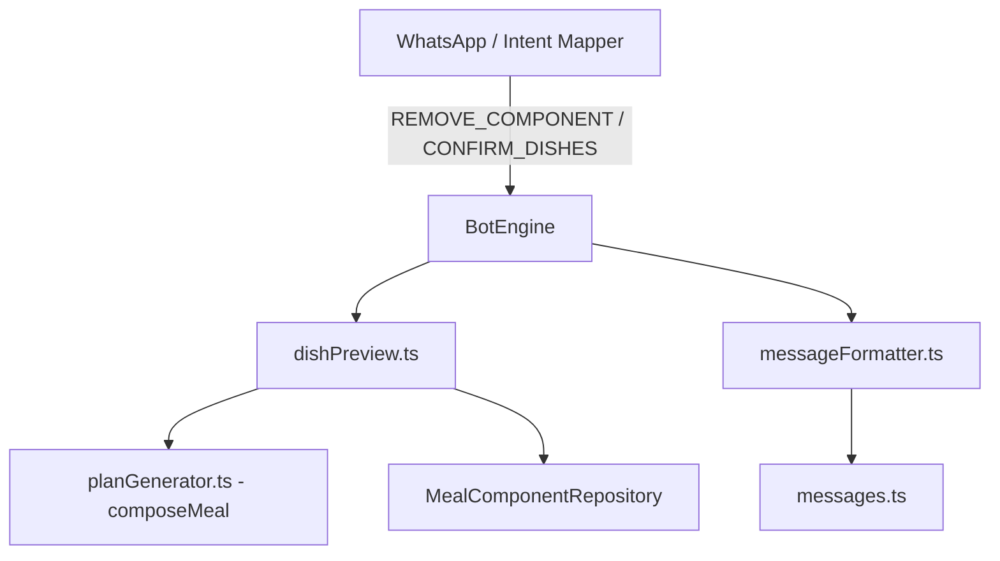
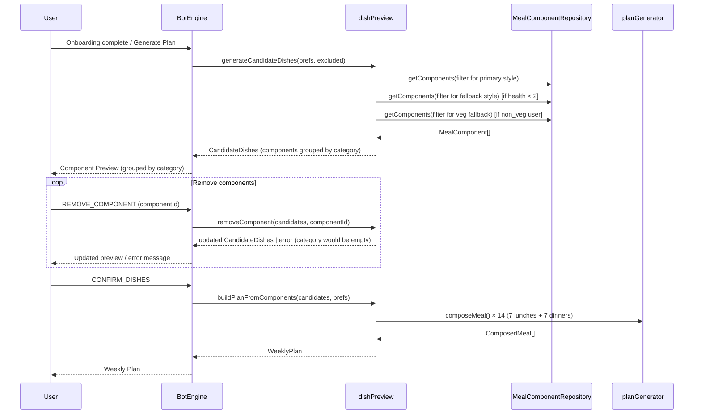
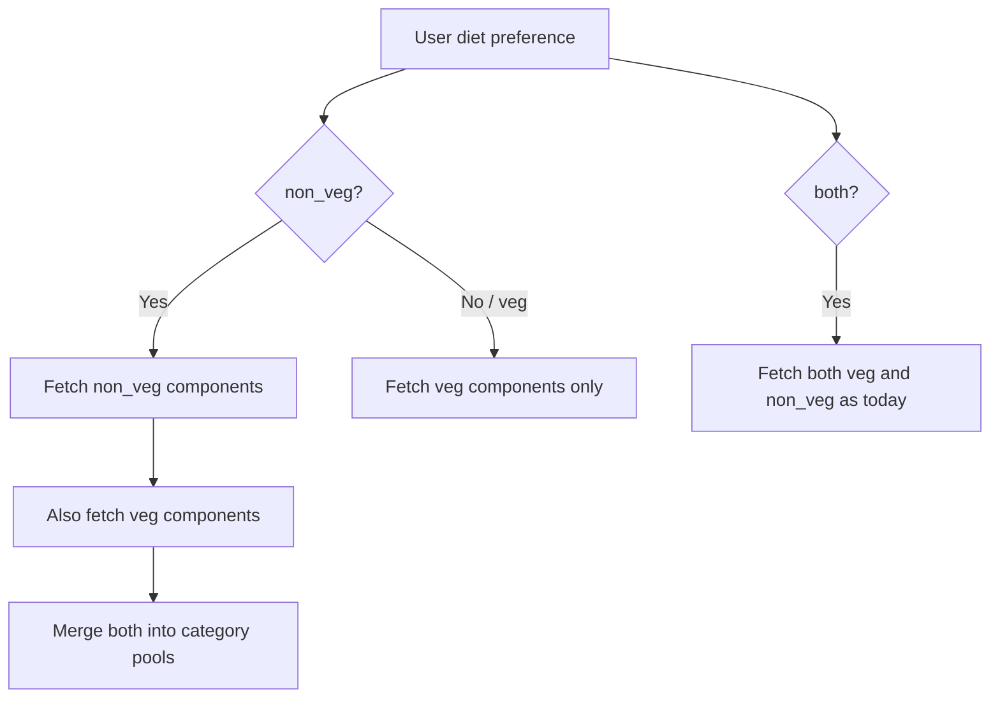

# Design Document: Component-Based Dish Preview

## Overview

This design transforms the dish preview flow for lunches and dinners from a composed-meal level to a component level. Currently, `generateCandidateDishes` pre-composes 7 lunches and 7 dinners as `ComposedMeal[]` and presents them to the user. When a user removes a composed meal, its individual components can still recombine into new meals, causing unwanted items to reappear.

The new design stores lunch/dinner candidates as flat arrays of `MealComponent[]` grouped by `ComponentCategory` (base, gravy, dry_veggie, side). Users exclude individual components. After confirmation, the system composes meals from the remaining non-excluded components using the existing `composeMeal` function with its variety constraints.

Breakfasts remain unchanged — they continue to be `Meal` objects with the existing remove-and-replace behavior.

### Key Design Decisions

1. **Component-level storage in CandidateDishes**: Instead of pre-composing meals, we store the raw component pool. This eliminates the root cause — removing a composed meal doesn't remove its components from the pool.
2. **Deferred composition**: Meal composition happens only at confirmation time, not at preview generation time. This simplifies the preview logic and ensures the user's exclusions are fully respected.
3. **Category-minimum guard**: The system enforces at least one component per category to guarantee meal composition is possible.
4. **Reuse of existing `composeMeal`**: The plan-building step reuses the existing `composeMeal` function from `planGenerator.ts`, preserving all variety constraints (sliding-window, same-day dedup, ingredient overlap avoidance).
5. **Style fallback at generation time**: When a health-preference user has fewer than 2 health-style components in any category, regular-style components are included as fallback with a "(Regular)" suffix on their name. This happens during `generateCandidateDishes`, not during composition.
6. **Diet fallback at generation time**: Non-veg users automatically receive veg components in addition to non-veg ones, expanding variety. Veg users never see non-veg components.

## Architecture

The change touches four layers of the system:



### Flow Diagram



### Fallback Flow (Style)

```mermaid
flowchart TD
    A[User prefers health style] --> B{Health components >= 2 in category?}
    B -->|Yes| C[Use health components only]
    B -->|No| D[Fetch regular components for that category]
    D --> E[Append regular components with '(Regular)' suffix]
    E --> F[Merge into category pool]
```

### Fallback Flow (Diet)



## Components and Interfaces

### 1. Updated `CandidateDishes` Type (`src/core/types.ts`)

The core type change. Lunches and dinners move from `ComposedMeal[]` to component arrays grouped by category.

```typescript
export interface ComponentsByCategory {
  base: MealComponent[];
  gravy: MealComponent[];
  dry_veggie: MealComponent[];
  side: MealComponent[];
}

export interface CandidateDishes {
  breakfasts: Meal[];
  lunchComponents: ComponentsByCategory;
  dinnerComponents: ComponentsByCategory;
}
```

### 2. Updated `dishPreview.ts` Functions

**`generateCandidateDishes(deps, preferences, excludedDishIds)`** — Replaces the current implementation. Instead of composing meals, it:
1. Fetches breakfasts as today (unchanged).
2. For each slot (lunch, dinner) and each category (base, gravy, dry_veggie, side):
   a. Fetches components matching user's cuisine, diet, style, and slot.
   b. Filters out excluded IDs.
   c. **Diet fallback**: If `diet === 'non_veg'`, also fetches veg components and merges them in.
   d. **Style fallback**: If `style === 'health'` and the filtered health components for this category are fewer than 2, fetches regular-style components for the same category/slot/cuisine/diet, appends "(Regular)" to their names, and merges them in.
3. Returns `CandidateDishes` with `lunchComponents` and `dinnerComponents` as `ComponentsByCategory`.

**`removeComponent(candidates, componentId)`** (new, replaces `removeDishAndReplace` for lunch/dinner) — Pure function that:
1. Searches all categories in `lunchComponents` and `dinnerComponents` for the component ID.
2. If found, checks whether removing it would leave the category empty. If so, returns `null` (guard).
3. Otherwise, returns updated `CandidateDishes` with the component filtered out, plus the removed component's name and category.

**`removeBreakfast(candidates, mealId, deps, preferences, excludedDishIds)`** — Extracted from the old `removeDishAndReplace`, handles breakfast removal only. Finds a replacement breakfast from the pool (unchanged behavior).

**`hasMinimumComponents(candidates)`** (new, replaces `hasMinimumDishes`) — Returns `true` if every category in both `lunchComponents` and `dinnerComponents` has at least one component, and `breakfasts` has at least one entry.

**`buildPlanFromComponents(candidates, preferences)`** (new, replaces `buildPlanFromCandidates`) — Composes the weekly plan:
1. For each of 7 days, calls `composeMeal` for lunch and dinner using the component pools from `lunchComponents` / `dinnerComponents`, passing full variety constraints (sliding-window history, same-day dedup).
2. Health-style components are prioritized over regular-style during composition (the `composeMeal` function already picks from the pool; we sort health-first within each category before passing to `composeMeal`).
3. Wraps breakfasts with reuse if fewer than 7.
4. Returns `WeeklyPlan`.

### 3. Updated `botEngine.ts` — `handleDishPreview`

- On `REMOVE_DISH` intent with a component ID payload:
  - First checks if it's a breakfast ID (searches `candidates.breakfasts`). If so, delegates to `removeBreakfast`.
  - Otherwise, delegates to `removeComponent`.
  - On success, adds the ID to `excludedDishIds` and returns `DISH_REMOVED` response.
  - On failure (category would be empty), returns `DISH_PREVIEW_EMPTY_ERROR`.
- On `CONFIRM_DISHES`, calls `buildPlanFromComponents` instead of `buildPlanFromCandidates`.
- No new intent needed — we reuse `REMOVE_DISH` since the button payload format (`remove_dish_{id}`) already carries the component ID.

### 4. Updated `messageFormatter.ts` and `messages.ts`

**`formatComponentPreviewMessage(candidates)`** (new, replaces `formatDishPreviewMessage` for the component section) — Formats the preview message with:
- Breakfast section (unchanged format)
- Lunch components grouped under category headings: `*🍚 Base*`, `*🍛 Gravy*`, `*🥗 Dry Veggie*`, `*🥣 Side*`
- Dinner components grouped under the same category headings
- Components with "(Regular)" suffix are displayed as-is (the suffix was added during generation)

**Button generation** — One `remove_dish_{componentId}` button per component (truncated to 20 chars), plus one `✅ Confirm Dishes` button. Breakfast buttons use `remove_dish_{mealId}` as today.

**`COMPONENT_REMOVED_CONFIRMATION(name, category)`** — New message: `Removed *{name}* from {category} 🔄`

**Updated `BotResponse.data`** — Adds optional fields:
```typescript
removedComponentName?: string;
removedComponentCategory?: string;
```

### 5. Updated `intentMapper.ts`

No change needed. The existing `remove_dish_` prefix pattern already works for component IDs since component IDs (e.g., `si-base-001`) are valid payload suffixes. The `REMOVE_DISH` intent is reused.

### 6. Style Fallback Logic (Requirement 8)

Implemented inside `generateCandidateDishes`:

```typescript
// For each category in each slot:
const healthComponents = allComponents.filter(c => c.style === 'health' && ...);
const afterExclusion = healthComponents.filter(c => !excludedSet.has(c.id));

if (afterExclusion.length < 2) {
  const regularComponents = allComponents.filter(c => c.style === 'regular' && ...);
  const regularFallback = regularComponents
    .filter(c => !excludedSet.has(c.id))
    .map(c => ({ ...c, name: `${c.name} (Regular)` }));
  categoryPool = [...afterExclusion, ...regularFallback];
} else {
  categoryPool = afterExclusion;
}
```

During `buildPlanFromComponents`, health-style components are prioritized by sorting them first in each category array before passing to `composeMeal`. The `pickComponent` function in `planGenerator.ts` already picks from the array with randomization, but we ensure health components appear first in the shuffled pool.

### 7. Diet Fallback Logic (Requirement 9)

Implemented inside `generateCandidateDishes`:

```typescript
// When fetching components for a non_veg user:
if (preferences.diet === 'non_veg') {
  // Fetch non_veg components
  const nonVegComponents = await deps.mealComponentRepository.getComponents({
    cuisine, style, slot, category, diet: 'non_veg'
  });
  // Also fetch veg components
  const vegComponents = await deps.mealComponentRepository.getComponents({
    cuisine, style, slot, category, diet: 'veg'
  });
  // Merge both pools
  allForCategory = [...nonVegComponents, ...vegComponents];
} else {
  // veg or both — use existing filter behavior
  allForCategory = await deps.mealComponentRepository.getComponents({
    cuisine, diet: preferences.diet, style, slot, category
  });
}
```

This ensures non-veg users see both veg and non-veg options. Veg users only see veg. "Both" users see both (existing behavior via the `both` filter value).

## Data Models

### CandidateDishes (Before → After)

**Before:**
```typescript
interface CandidateDishes {
  breakfasts: Meal[];
  lunches: ComposedMeal[];    // Pre-composed meals
  dinners: ComposedMeal[];    // Pre-composed meals
}
```

**After:**
```typescript
interface ComponentsByCategory {
  base: MealComponent[];
  gravy: MealComponent[];
  dry_veggie: MealComponent[];
  side: MealComponent[];
}

interface CandidateDishes {
  breakfasts: Meal[];
  lunchComponents: ComponentsByCategory;   // Raw component pools
  dinnerComponents: ComponentsByCategory;   // Raw component pools
}
```

### Exclusion List

The `excludedDishIds` field on `UserState` continues to store string IDs. For lunches/dinners, these are now `MealComponent.id` values. For breakfasts, they remain `Meal.id` values. No structural change needed — the field is already `string[]`.

### Serialization

`CandidateDishes` is serialized to DynamoDB as part of `UserState`. The new structure serializes naturally to JSON since `ComponentsByCategory` is a plain object with array values. No special serialization logic is needed.

### MealComponent (unchanged)

```typescript
interface MealComponent {
  id: string;
  name: string;
  category: ComponentCategory;  // 'base' | 'gravy' | 'dry_veggie' | 'side'
  cuisine: 'north_indian' | 'south_indian';
  diet: 'veg' | 'non_veg';
  style: 'health' | 'regular';
  slots: ('lunch' | 'dinner')[];
  ingredients: Ingredient[];
}
```

## Correctness Properties

*A property is a characteristic or behavior that should hold true across all valid executions of a system — essentially, a formal statement about what the system should do. Properties serve as the bridge between human-readable specifications and machine-verifiable correctness guarantees.*

### Property 1: Generated candidates match preferences and respect exclusion list

*For any* valid user preferences (cuisine, diet, style) and any exclusion list, every `MealComponent` in the generated `CandidateDishes` (across all categories in `lunchComponents` and `dinnerComponents`) SHALL match the user's cuisine and slot preferences, AND no component's ID SHALL appear in the exclusion list.

**Validates: Requirements 1.4, 1.5**

### Property 2: Component removal produces correct state transition

*For any* valid `CandidateDishes` and any component ID present in the candidates where the component's category has more than one entry, removing that component SHALL produce updated candidates where the component is absent from its category/slot, AND the component's ID SHALL be present in the updated exclusion list.

**Validates: Requirements 2.1, 3.2**

### Property 3: Removal confirmation contains component name and category

*For any* successful component removal, the bot response SHALL contain the removed component's name and its `ComponentCategory` label.

**Validates: Requirements 3.3, 7.3**

### Property 4: Formatted preview contains category headings with correct component names

*For any* `CandidateDishes` with non-empty component arrays, the formatted preview message SHALL contain the category headings "Base", "Gravy", "Dry Veggie", "Side", and every component name in `lunchComponents` and `dinnerComponents` SHALL appear in the formatted text under its corresponding category heading.

**Validates: Requirements 1.3, 7.1, 7.2**

### Property 5: Formatted response has one button per component plus confirm button

*For any* `CandidateDishes`, the formatted response SHALL include exactly one removal button per `MealComponent` (across all categories in `lunchComponents` and `dinnerComponents`) plus one removal button per breakfast, plus one "Confirm Dishes" button. Each removal button's ID SHALL encode the component's or meal's ID.

**Validates: Requirements 1.2, 7.4**

### Property 6: Confirmed plan structure with no excluded components

*For any* confirmed `CandidateDishes` where every category has at least one component, the resulting `WeeklyPlan` SHALL have exactly 7 `DayPlan` entries, each with a breakfast (`Meal`), lunch (`ComposedMeal`), and dinner (`ComposedMeal`), where every lunch and dinner has exactly one component per `ComponentCategory` (base, gravy, dry_veggie, side), and no component in any meal SHALL have an ID present in the exclusion list.

**Validates: Requirements 4.1, 4.2, 4.4**

### Property 7: CandidateDishes serialization round trip

*For any* valid `CandidateDishes` object, serializing to JSON and deserializing back SHALL produce a structurally equivalent object.

**Validates: Requirements 6.3**

### Property 8: Breakfast removal replaces with a different breakfast

*For any* `CandidateDishes` with at least 2 available breakfasts in the pool, removing a breakfast SHALL produce updated candidates with the same number of breakfasts, where the removed breakfast is replaced by a different one not in the exclusion list.

**Validates: Requirements 5.2**

### Property 9: Plan always produces 7 days even with limited component pools

*For any* `CandidateDishes` where every category in `lunchComponents` and `dinnerComponents` has at least one component and `breakfasts` has at least one entry, `buildPlanFromComponents` SHALL produce a `WeeklyPlan` with exactly 7 `DayPlan` entries (reusing components across days if necessary).

**Validates: Requirements 4.5**

### Property 10: Style fallback includes regular components with "(Regular)" suffix

*For any* user with style preference "health", and any category where the available health-style components (after exclusion) number fewer than 2, the generated `CandidateDishes` SHALL include regular-style components in that category, and every such regular fallback component's name SHALL end with "(Regular)".

**Validates: Requirements 8.1, 8.2**

### Property 11: Diet fallback rules

*For any* user with diet preference "non_veg", the generated `CandidateDishes` SHALL include both veg and non_veg components (when both exist in the data). *For any* user with diet preference "veg", no component in the generated candidates SHALL have `diet === 'non_veg'`. *For any* user with diet preference "both", the generated candidates SHALL include both veg and non_veg components.

**Validates: Requirements 9.1, 9.3, 9.4**

### Property 12: Preference change clears exclusion list

*For any* user state with a non-empty exclusion list, when the user changes their meal preference, the updated state SHALL have an empty exclusion list.

**Validates: Requirements 2.3**

## Error Handling

### Category Empty Guard (Requirement 3.4)

When a user attempts to remove the last component in a category, `removeComponent` returns `null`. The bot engine responds with `DISH_PREVIEW_EMPTY_ERROR` and re-presents the current preview unchanged. The removal is not applied and the exclusion list is not updated.

### Insufficient Components for Composition

If `buildPlanFromComponents` cannot compose a meal because a category pool is empty (should not happen due to the category-minimum guard), it throws an error. The bot engine catches this and returns a generic error response. This is a defensive measure — the guard in `removeComponent` and `hasMinimumComponents` should prevent this state.

### No Replacement Breakfast Available

When `removeBreakfast` cannot find a replacement (all available breakfasts are either already in the candidates or in the exclusion list), it returns `null`. The bot engine responds with the current preview unchanged (same as today's behavior).

### Empty Component Pool at Generation Time

If `generateCandidateDishes` finds zero components for any category after filtering and fallback, it still returns the `CandidateDishes` with an empty array for that category. The `hasMinimumComponents` check in the bot engine will detect this and can prompt the user to change preferences.

### Style Fallback Still Insufficient

If after applying the style fallback (including regular components), a category still has zero components, the system proceeds with whatever is available. The category-minimum guard at removal time prevents the user from reaching a state where composition is impossible.

## Testing Strategy

### Dual Testing Approach

This feature requires both unit tests and property-based tests for comprehensive coverage.

**Unit tests** focus on:
- Specific examples of component removal (remove a known component, verify it's gone)
- Edge cases: removing the last component in a category (should be rejected), empty exclusion list, single-component categories
- Integration between `generateCandidateDishes` and the mock `MealComponentRepository`
- Message formatting output for known inputs (snapshot-style)
- Breakfast removal and replacement with known pool

**Property-based tests** focus on:
- Universal properties that hold across all valid inputs (Properties 1–12 above)
- Comprehensive input coverage through randomized preferences, exclusion lists, and component pools

### Property-Based Testing Configuration

- **Library**: `fast-check` (already used in the project for existing property tests)
- **Minimum iterations**: 100 per property test
- **Tag format**: Each test is tagged with a comment referencing the design property:
  `// Feature: component-based-dish-preview, Property {N}: {property title}`

### Test Organization

- `tst/core/dishPreview.property.test.ts` — Property tests for `generateCandidateDishes`, `removeComponent`, `buildPlanFromComponents`, `hasMinimumComponents`
- `tst/core/dishPreview.test.ts` — Unit tests for specific examples and edge cases
- `tst/messageFormatter.test.ts` — Unit tests for `formatComponentPreviewMessage` (extend existing file)
- `tst/messageFormatter.property.test.ts` — Property tests for message formatting (Properties 4, 5)

### Property Test Implementation Notes

Each correctness property maps to a single property-based test:

| Property | Test Location | Generator Strategy |
|----------|--------------|-------------------|
| P1: Preference filtering & exclusion | `dishPreview.property.test.ts` | Generate random preferences + random exclusion subset of component IDs |
| P2: Removal state transition | `dishPreview.property.test.ts` | Generate random CandidateDishes, pick random component to remove |
| P3: Removal confirmation content | `dishPreview.property.test.ts` | Generate random removal, check response fields |
| P4: Category headings & names | `messageFormatter.property.test.ts` | Generate random CandidateDishes, check formatted text |
| P5: Button count & IDs | `messageFormatter.property.test.ts` | Generate random CandidateDishes, check button array |
| P6: Plan structure | `dishPreview.property.test.ts` | Generate random CandidateDishes with ≥1 per category, build plan |
| P7: Serialization round trip | `dishPreview.property.test.ts` | Generate random CandidateDishes, JSON round-trip |
| P8: Breakfast replacement | `dishPreview.property.test.ts` | Generate random breakfasts pool, remove one |
| P9: 7-day plan with limited pools | `dishPreview.property.test.ts` | Generate CandidateDishes with 1–3 components per category |
| P10: Style fallback | `dishPreview.property.test.ts` | Generate health-preference with sparse health components |
| P11: Diet fallback | `dishPreview.property.test.ts` | Generate non_veg/veg/both preferences, verify component diets |
| P12: Preference change clears exclusions | `botEngine.property.test.ts` | Generate state with non-empty exclusions, trigger preference change |
