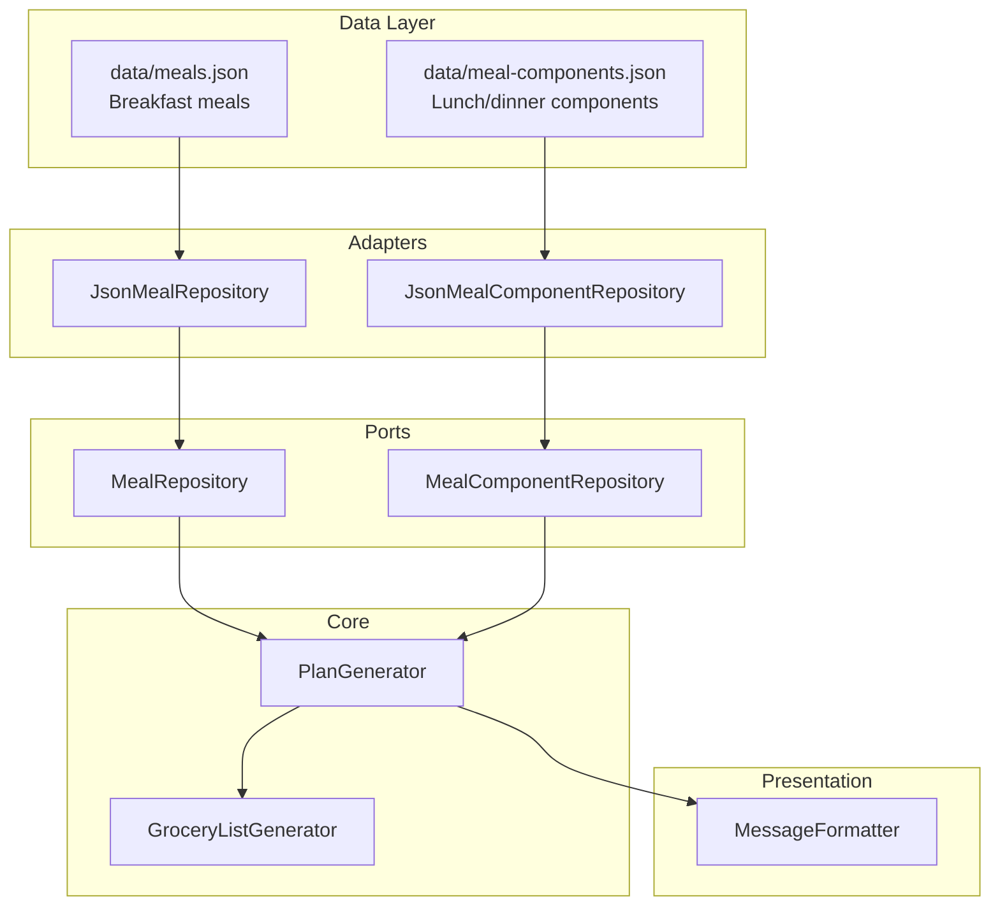

# Design Document: Component-Based Meals

## Overview

This feature transforms lunch and dinner from single atomic `Meal` objects into composed meals built from individual `MealComponent` items. Each component belongs to a category (base, gravy, dry_veggie, side) and carries its own cuisine, diet, style, slot, and ingredient metadata. At plan-generation time, the system selects one component per category and assembles them into a `ComposedMeal`, enforcing compatibility rules (same cuisine, matching diet/style, valid slot). Breakfast remains unchanged as a single `Meal`.

The change touches five modules:
1. **Types** (`src/core/types.ts`) — new `MealComponent`, `ComponentCategory`, `ComposedMeal` types; updated `DayPlan`.
2. **Repository** (`src/core/ports.ts` + `src/adapters/jsonMealComponentRepository.ts`) — new `MealComponentRepository` interface and JSON implementation loading from `data/meal-components.json`.
3. **Plan Generator** (`src/core/planGenerator.ts`) — new `composeMeal` function for lunch/dinner; variety constraints (3-day sliding window on gravy/dry_veggie, same-day gravy dedup, key-ingredient overlap avoidance).
4. **Grocery List Generator** (`src/core/groceryListGenerator.ts`) — extract ingredients from `ComposedMeal.ingredients` alongside single-dish `Meal` ingredients.
5. **Message Formatter** (`src/messageFormatter.ts`) — render `ComposedMeal.name` (comma-separated component names) in weekly plan, day plan, and cook messages.

Backward compatibility: existing serialized `WeeklyPlan` objects in DynamoDB user state that contain single-dish lunch/dinner `Meal` objects will be detected and the user prompted to regenerate.

## Architecture



The architecture preserves the existing hexagonal pattern. A new `MealComponentRepository` port sits alongside the existing `MealRepository`. The plan generator receives both repositories: `MealRepository` for breakfast selection (unchanged) and `MealComponentRepository` for composing lunch/dinner.

## Components and Interfaces

### New Types (`src/core/types.ts`)

```typescript
export type ComponentCategory = 'base' | 'gravy' | 'dry_veggie' | 'side';

export interface MealComponent {
  id: string;
  name: string;
  category: ComponentCategory;
  cuisine: 'north_indian' | 'south_indian';
  diet: 'veg' | 'non_veg';
  style: 'health' | 'regular';
  slots: ('lunch' | 'dinner')[];
  ingredients: Ingredient[];
}

export interface ComposedMeal {
  components: MealComponent[];
  name: string;        // comma-separated component names
  ingredients: Ingredient[];  // aggregated from all components
}
```

### Updated `DayPlan`

```typescript
export interface DayPlan {
  day: string;
  breakfast: Meal;
  lunch: ComposedMeal;
  dinner: ComposedMeal;
}
```

### New Port (`src/core/ports.ts`)

```typescript
export interface MealComponentFilter {
  cuisine?: 'north_indian' | 'south_indian' | 'both';
  diet?: 'veg' | 'non_veg' | 'both';
  style?: 'health' | 'regular';
  slot?: 'lunch' | 'dinner';
  category?: ComponentCategory;
}

export interface MealComponentRepository {
  getComponents(filter: MealComponentFilter): Promise<MealComponent[]>;
}
```

### New Adapter (`src/adapters/jsonMealComponentRepository.ts`)

Mirrors `JsonMealRepository` — reads `data/meal-components.json` at construction, filters in-memory. When `filter.cuisine` is `'both'`, returns components of all cuisines. Same pattern for `diet`.

### Updated `PlanGenerator`

New exported functions:

- `composeMeal(components: MealComponent[], slot, cuisine, usedGravyIds, usedDryVeggieIds, usedKeyIngredients): ComposedMeal` — picks one component per category respecting constraints.
- `generateWeeklyPlan(meals, components, preferences): WeeklyPlan` — updated signature accepts components; breakfast uses existing `Meal` logic, lunch/dinner use `composeMeal`.
- `swapTomorrowLunch(weeklyPlan, tomorrowIndex, components, preferences): SwapResult | null` — composes a new `ComposedMeal` avoiding the current gravy.

### Updated `GroceryListGenerator`

`generateGroceryList` currently accepts `Meal[]`. It will be updated to accept `(Meal | ComposedMeal)[]` or the function will extract a flat `Ingredient[]` from the plan. The simplest approach: extract all ingredients from the `WeeklyPlan` into a flat array before passing to the existing aggregation logic. `ComposedMeal.ingredients` already aggregates component ingredients, so the generator just reads that property the same way it reads `Meal.ingredients`.

### Updated `MessageFormatter`

`formatWeeklyPlan`, `formatDayPlan`, `formatCookMessage`, and `formatDayPlanBody` will read `day.lunch.name` and `day.dinner.name` — which are now `ComposedMeal.name` (comma-separated string). Since the formatter already uses `.name`, the only change is the type signature. The display format becomes e.g. "Rice, Sambar, Beans Poriyal, Curd".

## Data Models

### `MealComponent` JSON Schema (`data/meal-components.json`)

```json
[
  {
    "id": "si-base-001",
    "name": "Rice",
    "category": "base",
    "cuisine": "south_indian",
    "diet": "veg",
    "style": "health",
    "slots": ["lunch", "dinner"],
    "ingredients": [
      { "name": "Rice", "quantity": "300g", "category": "grains" }
    ]
  },
  {
    "id": "si-gravy-001",
    "name": "Sambar",
    "category": "gravy",
    "cuisine": "south_indian",
    "diet": "veg",
    "style": "health",
    "slots": ["lunch", "dinner"],
    "ingredients": [
      { "name": "Toor Dal", "quantity": "100g", "category": "lentils" },
      { "name": "Drumstick", "quantity": "1", "category": "vegetables" },
      { "name": "Sambar Powder", "quantity": "2 tbsp", "category": "spices" }
    ]
  }
]
```

ID convention: `{cuisine_prefix}-{category}-{nnn}` (e.g. `si-base-001`, `ni-gravy-003`).

### Composition Algorithm

For each lunch/dinner slot on each day:

1. Filter components by cuisine, diet, style, and slot.
2. Pick a **base** — random from filtered pool.
3. Pick a **gravy** — must not be in the 3-day sliding window for this slot, must not be the same gravy used in the other slot today, must not have key-ingredient overlap with the selected base.
4. Pick a **dry_veggie** — must not be in the 3-day sliding window for this slot, must not have key-ingredient overlap with the selected gravy or base.
5. Pick a **side** — random from filtered pool (sides are generic enough that variety constraints are unnecessary).
6. Assemble `ComposedMeal`:
   - `components`: `[base, gravy, dry_veggie, side]`
   - `name`: `components.map(c => c.name).join(', ')`
   - `ingredients`: `components.flatMap(c => c.ingredients)`

### Backward Compatibility

When loading `UserState.weeklyPlan` from DynamoDB, the system checks whether `lunch` has a `components` array. If not, it's a legacy single-dish plan. The system treats it as loadable (no crash) but sets a flag to prompt the user to regenerate.

### Cuisine Schedule (unchanged)

The existing `buildCuisineSchedule()` alternating pattern for "both" cuisine preference applies to component selection — all four components in a composed meal share the same cuisine for that slot on that day.


## Correctness Properties

*A property is a characteristic or behavior that should hold true across all valid executions of a system — essentially, a formal statement about what the system should do. Properties serve as the bridge between human-readable specifications and machine-verifiable correctness guarantees.*

### Property 1: Component schema validity

*For any* `MealComponent` loaded from `data/meal-components.json`, it shall have a non-empty `id`, non-empty `name`, a `category` that is one of `base | gravy | dry_veggie | side`, a valid `cuisine`, `diet`, `style`, a non-empty `slots` array containing only `lunch` and/or `dinner`, and a non-empty `ingredients` array.

**Validates: Requirements 1.1, 1.2, 1.3**

### Property 2: Composed meal structure — one component per category

*For any* generated weekly plan, every lunch and dinner `ComposedMeal` shall contain exactly four components: one `base`, one `gravy`, one `dry_veggie`, and one `side`.

**Validates: Requirements 2.1**

### Property 3: Composition compatibility

*For any* generated `ComposedMeal` targeting a given cuisine, diet, style, and slot, all four constituent `MealComponent` objects shall share the same cuisine value, be compatible with the user's diet preference, match the user's style preference, and include the target slot in their `slots` array.

**Validates: Requirements 2.2, 2.3, 2.4, 2.5, 8.2**

### Property 4: Gravy and dry_veggie sliding-window variety

*For any* generated weekly plan and for each slot (lunch, dinner), no gravy `MealComponent` shall appear more than once within any window of 3 consecutive days for that slot, and no dry_veggie `MealComponent` shall appear more than once within any window of 3 consecutive days for that slot.

**Validates: Requirements 3.1, 3.2**

### Property 5: Same-day gravy uniqueness

*For any* day in a generated weekly plan, the gravy `MealComponent` in the lunch `ComposedMeal` shall differ from the gravy `MealComponent` in the dinner `ComposedMeal`.

**Validates: Requirements 3.3**

### Property 6: Key-ingredient non-overlap within a composed meal

*For any* `ComposedMeal` in a generated weekly plan, the key ingredients of the gravy component and the key ingredients of the dry_veggie component shall have no overlap.

**Validates: Requirements 3.4**

### Property 7: Breakfast remains a single Meal

*For any* generated weekly plan, every `breakfast` field shall be a single `Meal` object (not a `ComposedMeal`), selected from the existing meals data.

**Validates: Requirements 4.1**

### Property 8: ComposedMeal name and ingredients derivation

*For any* set of `MealComponent` objects assembled into a `ComposedMeal`, the `name` property shall equal the comma-separated concatenation of the component names (in component-array order), and the `ingredients` property shall equal the flat concatenation of all component ingredient arrays.

**Validates: Requirements 5.3, 5.4**

### Property 9: Grocery list completeness from composed meals

*For any* weekly plan, every ingredient from every `MealComponent` within every `ComposedMeal` (lunch and dinner) and every ingredient from every breakfast `Meal` shall appear in the generated grocery list (matched by name, case-insensitive).

**Validates: Requirements 6.1, 6.3**

### Property 10: Grocery list deduplication

*For any* set of ingredients passed to the grocery list generator, the output shall contain at most one entry per unique ingredient name (case-insensitive), and the quantity of each entry shall combine all input quantities for that name.

**Validates: Requirements 6.2**

### Property 11: Formatted output contains composed meal component names

*For any* `DayPlan` with `ComposedMeal` lunch and dinner, the output of `formatWeeklyPlan`, `formatDayPlan`, and `formatCookMessage` shall each contain a comma-separated string of the component names for lunch and dinner.

**Validates: Requirements 7.1, 7.2, 7.3**

### Property 12: Swap produces a different composed meal

*For any* weekly plan and valid tomorrow index, swapping lunch shall produce a new `ComposedMeal` whose gravy component differs from the original lunch's gravy component.

**Validates: Requirements 8.1, 8.3**

### Property 13: Swap returns correct meal names

*For any* successful lunch swap, the returned `oldMeal` string shall equal the original `ComposedMeal.name` and the returned `newMeal` string shall equal the replacement `ComposedMeal.name`.

**Validates: Requirements 8.4**

### Property 14: Repository filtering correctness

*For any* `MealComponentFilter` and any set of `MealComponent` objects, `getComponents(filter)` shall return exactly those components that match all specified filter fields — and when `cuisine` is `'both'`, components of all cuisines shall be included.

**Validates: Requirements 9.1, 9.3, 9.4**

### Property 15: Legacy plan backward compatibility

*For any* serialized `UserState` containing a weekly plan with single-dish `Meal` objects for lunch/dinner (legacy format), loading the state shall not throw an error, and the system shall signal that the plan needs regeneration.

**Validates: Requirements 10.1, 10.2**

## Error Handling

| Scenario | Behavior |
|---|---|
| Not enough components in a category to fill 7 days | Throw descriptive error: "Not enough {category} components for {cuisine}/{diet}/{style} to fill 7 days" |
| `data/meal-components.json` missing or malformed | Throw at repository construction time with file path in message |
| No gravy available that satisfies sliding-window + same-day constraints | Relax constraints progressively (same pattern as existing `pickMealFromCursor`): first relax key-ingredient overlap, then relax 3-day window, then relax same-day uniqueness |
| Swap finds no alternative gravy | Return `null` from `swapTomorrowLunch`, triggering `SWAP_NO_ALTERNATIVE` response (existing pattern) |
| Legacy plan detected in user state | Plan loads without error; bot responds with `EXPIRED_PLAN_PROMPT` prompting regeneration |
| Component with invalid category in JSON | Validate at load time; skip or throw depending on strictness preference (recommend: throw to catch data errors early) |

## Testing Strategy

### Property-Based Tests (fast-check)

The project already uses `fast-check` with Vitest. Each correctness property above maps to one property-based test. Minimum 100 iterations per test (configured in `vitest.config.ts` via `fuzz.numRuns`).

New test files:
- `tst/core/composedMeal.property.test.ts` — Properties 2, 3, 4, 5, 6, 7, 8
- `tst/core/planGenerator.composed.property.test.ts` — Properties 4, 5, 6, 12, 13 (plan-level)
- `tst/core/groceryListGenerator.composed.property.test.ts` — Properties 9, 10
- `tst/messageFormatter.composed.property.test.ts` — Property 11
- `tst/adapters/mealComponentRepository.property.test.ts` — Property 14
- `tst/adapters/mealComponentDataSchema.test.ts` — Property 1
- `tst/core/legacyPlan.property.test.ts` — Property 15

Each test must be tagged with a comment:
```typescript
// Feature: component-based-meals, Property 2: Composed meal structure — one component per category
```

### Arbitraries

Key fast-check arbitraries to build:
- `mealComponentArb(category, cuisine, diet, style, slot)` — generates a `MealComponent` with given constraints
- `componentPoolArb(cuisine, diet, style)` — generates a pool with enough components per category (≥8 per category) for 7-day plan generation
- `composedMealArb(cuisine, diet, style, slot)` — generates a valid `ComposedMeal` from random components
- `weeklyPlanWithComposedMealsArb()` — generates a full weekly plan for plan-level property tests

### Unit Tests

Unit tests complement property tests for specific examples and edge cases:
- `tst/core/composedMeal.test.ts` — specific composition examples (e.g. south Indian lunch with known components)
- `tst/core/planGenerator.composed.test.ts` — edge cases: minimal component pool, single-cuisine pool
- `tst/adapters/jsonMealComponentRepository.test.ts` — loading from fixture file, filter combinations
- `tst/core/legacyPlan.test.ts` — specific legacy plan JSON structures

Unit tests should be kept minimal — property tests handle broad input coverage. Unit tests focus on:
- Concrete examples that demonstrate correct behavior
- Integration points (repository → generator → formatter)
- Edge cases (empty pools, single-component categories)
- Error conditions (missing file, malformed JSON)
