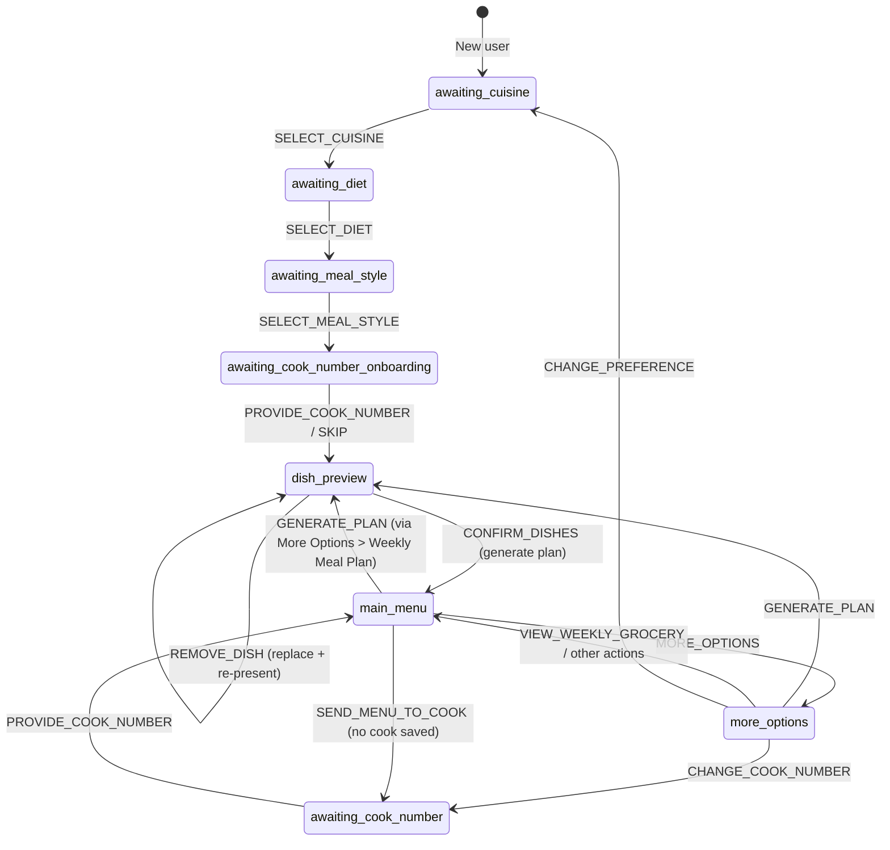
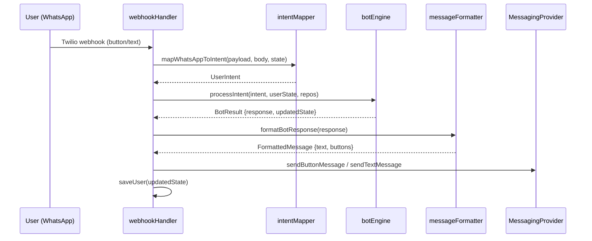

# Design Document: Enhanced Meal Planner UX

## Overview

This design enhances the WhatsApp meal planner bot with six UX improvements that change the conversation flow, menu structure, and onboarding experience. The changes touch the core state machine (`botEngine.ts`), intent mapping (`intentMapper.ts`), message formatting (`messageFormatter.ts`), message catalog (`messages.ts`), and type definitions (`types.ts`).

Key design goals:
- Introduce a **dish preview flow** with interactive removal/replacement before weekly plan generation
- Add **cook's number collection** as an optional onboarding step
- **Auto-generate** the first weekly plan after onboarding completes
- Restructure the **main menu** into quick actions + a "More Options" submenu
- Move the **weekly grocery list** behind the More Options menu (on-demand only)
- Support **preference and cook number editing** from More Options

The architecture remains a hexagonal/ports-and-adapters pattern. All new logic lives in the core layer (`src/core/`), with the WhatsApp-specific formatting and intent mapping in the outer layer.

## Architecture

### Conversation State Machine

The existing state machine routes by `ConversationState`. This design adds new states for the dish preview flow and the more-options submenu, and inserts the cook number step into onboarding.



### Request Flow

The existing request flow is preserved. The webhook handler receives a Twilio payload, maps it to a `UserIntent`, passes it to `processIntent`, formats the `BotResponse`, and sends it back via the messaging provider. The new states and intents slot into this pipeline without structural changes.



## Components and Interfaces

### 1. New Conversation States

Add to `ConversationState` union in `types.ts`:

```typescript
export type ConversationState =
  | 'awaiting_cuisine'
  | 'awaiting_diet'
  | 'awaiting_meal_style'
  | 'awaiting_cook_number_onboarding'  // NEW: cook number during onboarding
  | 'dish_preview'                      // NEW: reviewing candidate dishes
  | 'main_menu'
  | 'more_options'                      // NEW: more options submenu
  | 'awaiting_cook_number'              // existing: editing cook number
  | 'awaiting_preference_cuisine'       // NEW: changing cuisine preference
  | 'awaiting_preference_diet';         // NEW: changing diet preference
```

### 2. New Intents

Add to `Intent` enum in `types.ts`:

```typescript
export enum Intent {
  // ... existing intents ...
  SKIP_COOK_NUMBER = 'SKIP_COOK_NUMBER',       // Skip cook number during onboarding
  REMOVE_DISH = 'REMOVE_DISH',                 // Remove a dish from preview
  CONFIRM_DISHES = 'CONFIRM_DISHES',           // Confirm dish preview
  MORE_OPTIONS = 'MORE_OPTIONS',               // Open more options submenu
  CHANGE_PREFERENCE = 'CHANGE_PREFERENCE',     // Start preference change flow
  CHANGE_COOK_NUMBER = 'CHANGE_COOK_NUMBER',   // Start cook number change
}
```

### 3. New Response Types

Add to `ResponseType` enum in `types.ts`:

```typescript
export enum ResponseType {
  // ... existing types ...
  COOK_NUMBER_ONBOARDING_PROMPT = 'COOK_NUMBER_ONBOARDING_PROMPT',
  DISH_PREVIEW = 'DISH_PREVIEW',
  DISH_REMOVED = 'DISH_REMOVED',
  DISH_PREVIEW_EMPTY_ERROR = 'DISH_PREVIEW_EMPTY_ERROR',
  MORE_OPTIONS_MENU = 'MORE_OPTIONS_MENU',
}
```

### 4. UserState Extensions

Add new fields to `UserState` in `types.ts`:

```typescript
export interface UserState {
  // ... existing fields ...
  excludedDishIds?: string[];           // Persistent exclusion list (cleared on preference change)
  candidateDishes?: CandidateDishes;    // Current dish preview state
  isPreferenceChange?: boolean;         // Flag: user is changing preferences (not onboarding)
}

export interface CandidateDishes {
  breakfasts: Meal[];
  lunches: ComposedMeal[];
  dinners: ComposedMeal[];
}
```

### 5. BotResponse Data Extensions

Extend the `data` field on `BotResponse`:

```typescript
export interface BotResponse {
  type: ResponseType;
  data?: {
    // ... existing fields ...
    candidateDishes?: CandidateDishes;
    removedDishName?: string;
    replacementDishName?: string;
  };
  suggestedActions?: SuggestedAction[];
}
```

### 6. Dish Preview Logic (new module: `src/core/dishPreview.ts`)

This module handles candidate dish generation, removal, and replacement:

```typescript
// src/core/dishPreview.ts

export interface DishPreviewDeps {
  mealRepository: MealRepository;
  mealComponentRepository: MealComponentRepository;
}

/** Generate candidate dishes for preview, excluding any in the exclusion list */
export async function generateCandidateDishes(
  deps: DishPreviewDeps,
  preferences: { cuisine: string; diet: string; style: string },
  excludedDishIds: string[],
): Promise<CandidateDishes>;

/** Remove a dish by ID and replace it with a new one from the pool */
export async function removeDishAndReplace(
  candidates: CandidateDishes,
  dishId: string,
  deps: DishPreviewDeps,
  preferences: { cuisine: string; diet: string; style: string },
  excludedDishIds: string[],
): Promise<{ updated: CandidateDishes; removedName: string; replacementName: string } | null>;

/** Check if candidate dishes have at least one dish per meal slot */
export function hasMinimumDishes(candidates: CandidateDishes): boolean;

/** Convert confirmed candidate dishes into a WeeklyPlan */
export function buildPlanFromCandidates(candidates: CandidateDishes): WeeklyPlan;
```

### 7. Updated Intent Mapper

The `mapWhatsAppToIntent` function needs new mappings:

| Button Payload | State | Intent |
|---|---|---|
| `skip_cook` | `awaiting_cook_number_onboarding` | `SKIP_COOK_NUMBER` |
| `remove_dish_{id}` | `dish_preview` | `REMOVE_DISH` (payload = dish id) |
| `confirm_dishes` | `dish_preview` | `CONFIRM_DISHES` |
| `more_options` | `main_menu` | `MORE_OPTIONS` |
| `weekly_plan` | `more_options` | `GENERATE_PLAN` |
| `weekly_grocery` | `more_options` | `VIEW_WEEKLY_GROCERY` |
| `change_preference` | `more_options` | `CHANGE_PREFERENCE` |
| `change_cook_number` | `more_options` | `CHANGE_COOK_NUMBER` |

### 8. Updated Message Formatter

New button sets for the restructured menus:

```typescript
// Main Menu (4 quick actions)
const MAIN_MENU_BUTTONS: ButtonOption[] = [
  { id: 'tomorrow_plan', title: "Tomorrow's Meal Plan" },
  { id: 'tomorrow_grocery', title: "Tomorrow's Grocery" },
  { id: 'send_to_cook', title: 'Send Menu to Cook' },
  { id: 'more_options', title: 'More Options' },
];

// More Options Submenu (4 actions)
const MORE_OPTIONS_BUTTONS: ButtonOption[] = [
  { id: 'weekly_plan', title: 'Weekly Meal Plan' },
  { id: 'weekly_grocery', title: 'View Weekly Grocery List' },
  { id: 'change_preference', title: 'Change Meal Preference' },
  { id: 'change_cook_number', title: "Change Cook's Number" },
];
```

### 9. Bot Engine Changes

The `processIntent` function gains new state handlers:

- `handleAwaitingCookNumberOnboarding`: Validates phone or handles skip, then triggers dish preview generation and transitions to `dish_preview`
- `handleDishPreview`: Handles `REMOVE_DISH` (replace + re-present), `CONFIRM_DISHES` (build plan + transition to `main_menu`), and the empty-dishes edge case
- `handleMoreOptions`: Routes `GENERATE_PLAN`, `VIEW_WEEKLY_GROCERY`, `CHANGE_PREFERENCE`, `CHANGE_COOK_NUMBER`
- `handleAwaitingPreferenceCuisine` / `handleAwaitingPreferenceDiet`: Re-use existing onboarding logic but set `isPreferenceChange` flag, clear `excludedDishIds` on completion, and regenerate the plan

The `handleAwaitingMealStyle` handler changes: instead of completing onboarding and going to `main_menu`, it transitions to `awaiting_cook_number_onboarding`.

After onboarding completes (cook number provided or skipped), the engine auto-generates candidate dishes and enters `dish_preview` state. Once the user confirms dishes, the plan is built and the main menu is shown with a grocery list hint.

## Data Models

### UserState (DynamoDB)

Updated schema with new fields:

| Field | Type | Description |
|---|---|---|
| `phoneNumber` | `string` | Partition key |
| `onboardingComplete` | `boolean` | Whether onboarding is done |
| `conversationState` | `ConversationState` | Current state in the conversation |
| `cuisinePreference` | `string?` | north_indian / south_indian / both |
| `dietPreference` | `string?` | veg / non_veg / both |
| `mealStyle` | `string?` | health / regular |
| `weeklyPlan` | `WeeklyPlan?` | Current 7-day plan |
| `weeklyPlanStartDate` | `string?` | ISO date of plan's Monday |
| `cookPhoneNumber` | `string?` | Cook's WhatsApp number |
| `excludedDishIds` | `string[]?` | **NEW** — Dish IDs removed by user, persisted across sessions |
| `candidateDishes` | `CandidateDishes?` | **NEW** — Temporary dish preview state |
| `isPreferenceChange` | `boolean?` | **NEW** — Flag for preference change flow |

### CandidateDishes

```typescript
interface CandidateDishes {
  breakfasts: Meal[];        // 7 breakfast dishes
  lunches: ComposedMeal[];   // 7 composed lunch meals
  dinners: ComposedMeal[];   // 7 composed dinner meals
}
```

Each array holds exactly 7 items (one per day). When a dish is removed, it is replaced in-place at the same index with a new dish from the available pool (excluding all `excludedDishIds`).

### Exclusion List Lifecycle

- `excludedDishIds` accumulates dish IDs as the user removes dishes from previews
- Cleared when the user changes their `Meal_Preference` (via "Change Meal Preference")
- Persisted in DynamoDB alongside other user state
- Applied as a filter when generating candidate dishes and weekly plans

## Correctness Properties

*A property is a characteristic or behavior that should hold true across all valid executions of a system — essentially, a formal statement about what the system should do. Properties serve as the bridge between human-readable specifications and machine-verifiable correctness guarantees.*

### Property 1: Plan generation always goes through dish preview

*For any* onboarded user with valid preferences in `main_menu` or `more_options` state, when a `GENERATE_PLAN` intent is processed, the resulting response type should be `DISH_PREVIEW` (not `WEEKLY_PLAN`) and the updated state's `conversationState` should be `dish_preview`.

**Validates: Requirements 1.1**

### Property 2: Dish removal preserves candidate count with a different replacement

*For any* `CandidateDishes` and any valid dish ID within those candidates, calling `removeDishAndReplace` should produce an updated `CandidateDishes` where: (a) the total number of dishes per slot remains 7, (b) the dish at the removed position is different from the original, and (c) the removed dish's ID is added to the exclusion list.

**Validates: Requirements 1.3, 1.4**

### Property 3: Excluded dishes never appear in candidate generation

*For any* set of excluded dish IDs and any valid user preferences, generating candidate dishes should produce a `CandidateDishes` where no dish (breakfast, lunch component, or dinner component) has an ID present in the exclusion list.

**Validates: Requirements 1.5**

### Property 4: Confirmed candidates produce a matching weekly plan

*For any* valid `CandidateDishes`, calling `buildPlanFromCandidates` should produce a `WeeklyPlan` of length 7 where each day's breakfast, lunch, and dinner match the corresponding entries in the candidates arrays by index.

**Validates: Requirements 1.6**

### Property 5: Meal style selection transitions to cook number onboarding

*For any* user in `awaiting_meal_style` state and any valid meal style value (`health` or `regular`), processing a `SELECT_MEAL_STYLE` intent should produce a state with `conversationState` equal to `awaiting_cook_number_onboarding` and a response of type `COOK_NUMBER_ONBOARDING_PROMPT`.

**Validates: Requirements 2.1**

### Property 6: Cook number onboarding validates phone input correctly

*For any* user in `awaiting_cook_number_onboarding` state and any string input: if the input matches the phone pattern (`+` followed by 10–15 digits), the cook number should be saved and the state should advance; if the input does not match, the response should be `INVALID_PHONE` and the state should remain `awaiting_cook_number_onboarding`.

**Validates: Requirements 2.3, 2.5**

### Property 7: Skipping cook number advances without saving

*For any* user in `awaiting_cook_number_onboarding` state, processing a `SKIP_COOK_NUMBER` intent should produce an updated state where `cookPhoneNumber` is unchanged (still undefined if not previously set) and the conversation advances to the dish preview flow.

**Validates: Requirements 2.4**

### Property 8: Onboarding completion auto-triggers dish preview

*For any* user completing onboarding (via valid cook number or skip in `awaiting_cook_number_onboarding` state), the resulting state should have `onboardingComplete` set to `true`, `conversationState` set to `dish_preview`, and `candidateDishes` populated with 7 dishes per slot.

**Validates: Requirements 3.1, 3.2**

### Property 9: Weekly plan message includes grocery hint text

*For any* `BotResponse` of type `WEEKLY_PLAN`, the formatted message text should contain a hint string directing the user to "More Options" for the weekly grocery list.

**Validates: Requirements 3.3, 4.1**

### Property 10: Weekly plan response uses restructured main menu without grocery

*For any* `BotResponse` of type `WEEKLY_PLAN`, the suggested actions / buttons should contain exactly the four main menu items ("Tomorrow's Meal Plan", "Tomorrow's Grocery", "Send Menu to Cook", "More Options") and the response data should not include a `groceryList` field.

**Validates: Requirements 4.2, 4.3**

### Property 11: Menu responses contain the correct button sets

*For any* `BotResponse` of type `MAIN_MENU`, the buttons should be exactly ["Tomorrow's Meal Plan", "Tomorrow's Grocery", "Send Menu to Cook", "More Options"]. *For any* `BotResponse` of type `MORE_OPTIONS_MENU`, the buttons should be exactly ["Weekly Meal Plan", "View Weekly Grocery List", "Change Meal Preference", "Change Cook's Number"].

**Validates: Requirements 5.1, 6.1**

### Property 12: Preference change clears the exclusion list

*For any* user in `more_options` state with a non-empty `excludedDishIds`, processing a `CHANGE_PREFERENCE` intent should produce an updated state where `excludedDishIds` is empty and `conversationState` is `awaiting_preference_cuisine`.

**Validates: Requirements 6.4**

## Error Handling

### Dish Preview Errors

- **No replacement available**: If the dish pool is exhausted after exclusions, `removeDishAndReplace` returns `null`. The bot should inform the user that no alternative is available and keep the current preview unchanged.
- **Empty preview**: If `hasMinimumDishes` returns `false` after a removal attempt, the bot returns `DISH_PREVIEW_EMPTY_ERROR` and re-presents the original preview (before the removal).
- **Invalid dish ID**: If the user sends a `REMOVE_DISH` intent with an ID not in the current candidates, treat it as `INVALID_INPUT` and re-present the current preview.

### Cook Number Errors

- **Invalid phone during onboarding**: Return `INVALID_PHONE` response and stay in `awaiting_cook_number_onboarding` with the Skip button still available.
- **Invalid phone during edit**: Return `INVALID_PHONE` response and stay in `awaiting_cook_number`.

### Plan Generation Errors

- **Insufficient meals in repository**: If `generateCandidateDishes` cannot fill 7 slots for any meal type, throw an error caught by the engine, returning `ResponseType.ERROR`.
- **No plan exists for grocery/tomorrow actions**: Return `NO_PLAN_ERROR` with a button to generate a plan (existing behavior).

### State Recovery

- **Stale `candidateDishes`**: If a user returns after a long time with `dish_preview` state but the candidate data is stale, the bot should regenerate candidates rather than showing old data.
- **Legacy plan detection**: The existing `isLegacyPlan` check continues to handle old plan formats.

## Testing Strategy

### Property-Based Testing

Use `fast-check` (already installed in the project) for property-based tests. Each property test should:
- Run a minimum of 100 iterations
- Reference the design property with a tag comment
- Use arbitraries to generate random user states, preferences, dish sets, and phone numbers

Property tests to implement (one test per property):

1. **Feature: enhanced-meal-planner-ux, Property 1: Plan generation always goes through dish preview** — Generate random onboarded user states with valid preferences, process GENERATE_PLAN, assert response type is DISH_PREVIEW.

2. **Feature: enhanced-meal-planner-ux, Property 2: Dish removal preserves candidate count with replacement** — Generate random CandidateDishes and pick a random dish to remove, assert count preserved and dish changed.

3. **Feature: enhanced-meal-planner-ux, Property 3: Excluded dishes never appear in candidates** — Generate random exclusion lists and preferences, generate candidates, assert no excluded ID appears.

4. **Feature: enhanced-meal-planner-ux, Property 4: Confirmed candidates produce matching plan** — Generate random CandidateDishes, build plan, assert each day matches by index.

5. **Feature: enhanced-meal-planner-ux, Property 5: Meal style transitions to cook number onboarding** — Generate random valid meal style values, process intent, assert state transition.

6. **Feature: enhanced-meal-planner-ux, Property 6: Cook number onboarding validates phone correctly** — Generate random strings (valid and invalid phone formats), process intent, assert correct behavior.

7. **Feature: enhanced-meal-planner-ux, Property 7: Skip advances without saving cook number** — Generate random user states in awaiting_cook_number_onboarding, process SKIP, assert cookPhoneNumber unchanged.

8. **Feature: enhanced-meal-planner-ux, Property 8: Onboarding completion auto-triggers dish preview** — Generate random preference combinations, complete onboarding, assert dish_preview state with populated candidates.

9. **Feature: enhanced-meal-planner-ux, Property 9: Weekly plan message includes grocery hint** — Generate random WeeklyPlan data, format WEEKLY_PLAN response, assert hint text present.

10. **Feature: enhanced-meal-planner-ux, Property 10: Weekly plan uses restructured menu without grocery** — Generate random WEEKLY_PLAN responses, assert button set and no grocery data.

11. **Feature: enhanced-meal-planner-ux, Property 11: Menu responses contain correct button sets** — Generate random MAIN_MENU and MORE_OPTIONS_MENU responses, assert exact button sets.

12. **Feature: enhanced-meal-planner-ux, Property 12: Preference change clears exclusion list** — Generate random user states with non-empty exclusion lists, process CHANGE_PREFERENCE, assert exclusion list cleared.

### Unit Testing

Use `vitest` (already configured) for unit tests covering:

- **Edge cases**: Empty dish pool, all dishes excluded, minimum dishes boundary
- **Integration**: Full onboarding flow end-to-end (cuisine → diet → style → cook number → dish preview → confirm → main menu)
- **Intent mapping**: New button payloads and text inputs map to correct intents for each new state
- **Message formatting**: New response types produce correct text and button structures
- **State transitions**: Each new state handler transitions correctly for valid and invalid inputs
- **Backward compatibility**: Existing main menu actions (tomorrow's plan, tomorrow's grocery, send to cook) continue to work with the restructured menu
