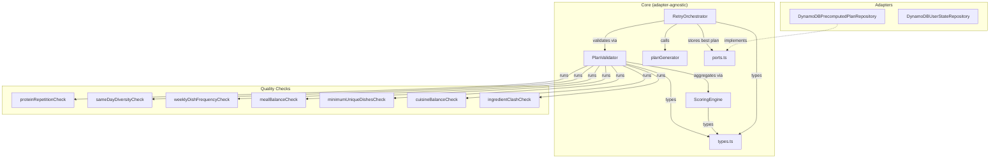
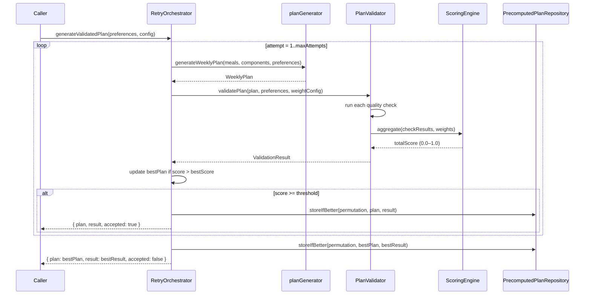

# Design Document: Meal Plan Validation & Scoring

## Overview

This design introduces an automated validation and scoring layer that evaluates generated `WeeklyPlan` objects against 7 weighted quality checks, producing a normalized 0.0–1.0 score. Plans scoring above a configurable threshold are accepted immediately; otherwise a retry loop (up to 3 attempts) regenerates and tracks the best-scoring plan as a fallback.

The system integrates into the existing ports-and-adapters architecture:
- A new `PlanValidator` module in `src/core/` runs quality checks and computes weighted scores.
- A new `RetryOrchestrator` wraps `generateWeeklyPlan` with retry logic and best-plan tracking.
- A new `PrecomputedPlanRepository` port (with DynamoDB adapter) stores the highest-scoring plan per preference permutation.
- All validation results include per-check breakdowns with violation details for debugging.

Key design decisions:
- **Pure functions for checks**: Each quality check is a standalone pure function `(WeeklyPlan, config?) => CheckResult`. This makes them independently testable and composable.
- **Weight config as data**: Weights are a plain `Record<string, number>` object, not hardcoded. Adding a new check means adding one entry — the aggregation formula is generic.
- **Retry is orchestration, not recursion**: The retry loop is a simple `for` loop with early exit, not recursive. This keeps the call stack flat and the logic easy to follow.
- **Score-gated DynamoDB writes**: The repository compares scores before writing, so DynamoDB throughput is only consumed when a genuinely better plan arrives.

## Architecture



### Validation & Retry Flow



## Components and Interfaces

### 1. Quality Check Functions (in `src/core/planValidator.ts`)

Each check is a pure function with the signature:

```typescript
type QualityCheckFn = (plan: WeeklyPlan, options?: QualityCheckOptions) => CheckResult;
```

Seven checks are implemented:

| Check | Weight | What it measures |
|---|---|---|
| `proteinRepetitionCheck` | 3 | Same protein keyIngredient on consecutive days |
| `sameDayDiversityCheck` | 2 | Lunch/dinner sharing gravy or dry_veggie on same day |
| `weeklyDishFrequencyCheck` | 2 | Any component ID appearing >2 times across 14 slots |
| `mealBalanceCheck` | 2 | Each ComposedMeal has all 4 categories |
| `minimumUniqueDishesCheck` | 1 | Distinct component IDs ≥ configurable minimum (default 12) |
| `cuisineBalanceCheck` | 1 | 40–60% split when cuisine preference is "both" |
| `ingredientClashCheck` | 1 | Shared signature ingredients or cross-group proteins within a meal |

### 2. `ScoringEngine` (in `src/core/planValidator.ts`)

A single pure function:

```typescript
function aggregateScore(checkResults: CheckResult[], weightConfig: WeightConfig): number
```

Computes `Σ(score_i × weight_i) / Σ(weight_i)`, returning a value in `[0.0, 1.0]`.

### 3. `PlanValidator` (in `src/core/planValidator.ts`)

Orchestrates all checks and produces a `ValidationResult`:

```typescript
function validatePlan(
  plan: WeeklyPlan,
  preferences: { cuisine: string },
  weightConfig: WeightConfig,
  options?: { minUniqueDishes?: number }
): ValidationResult
```

### 4. `RetryOrchestrator` (in `src/core/retryOrchestrator.ts`)

Wraps plan generation with validation and retry:

```typescript
function generateValidatedPlan(
  generateFn: () => WeeklyPlan,
  preferences: { cuisine: string },
  config: RetryConfig
): RetryOutcome
```

- Calls `generateFn` up to `config.maxAttempts` times (default 3).
- Tracks the best-scoring plan across all attempts.
- Returns early on the first plan that meets `config.scoreThreshold`.
- Logs each attempt's `ValidationResult` (attempt number, score, accepted/rejected).
- Returns the best plan with a flag indicating whether it passed the threshold or was a fallback.

### 5. `PrecomputedPlanRepository` Port (in `src/core/ports.ts`)

```typescript
export interface PrecomputedPlanRepository {
  getPrecomputedPlan(key: PreferenceKey): Promise<PrecomputedPlanEntry | null>;
  storeIfBetter(key: PreferenceKey, plan: WeeklyPlan, result: ValidationResult): Promise<boolean>;
}
```

`storeIfBetter` reads the current entry, compares scores, and writes only if the new score is strictly greater (or no entry exists). Returns `true` if the plan was stored.

### 6. `DynamoDBPrecomputedPlanRepository` Adapter (in `src/adapters/dynamodbPrecomputedPlanRepository.ts`)

Implements `PrecomputedPlanRepository` using a DynamoDB table. The partition key is a composite string `{cuisine}#{diet}#{style}`. Uses a conditional put to avoid race conditions: `attribute_not_exists(pk) OR score < :newScore`.

## Data Models

### CheckResult

```typescript
interface CheckResult {
  checkName: string;
  score: number;          // 0.0–1.0
  weight: number;
  weightedScore: number;  // score × weight
  passed: boolean;        // score === 1.0
  violations: Violation[];
}

interface Violation {
  description: string;    // e.g. "Protein 'chicken' repeats on Monday→Tuesday"
  details?: Record<string, unknown>;
}
```

### ValidationResult

```typescript
interface ValidationResult {
  totalScore: number;     // 0.0–1.0 normalized
  passed: boolean;        // totalScore >= threshold
  checks: CheckResult[];
}
```

### WeightConfig

```typescript
type WeightConfig = Record<string, number>;

const DEFAULT_WEIGHT_CONFIG: WeightConfig = {
  proteinRepetition: 3,
  sameDayDiversity: 2,
  weeklyDishFrequency: 2,
  mealBalance: 2,
  minimumUniqueDishes: 1,
  cuisineBalance: 1,
  ingredientClash: 1,
};
```

### RetryConfig

```typescript
interface RetryConfig {
  maxAttempts: number;      // default 3
  scoreThreshold: number;   // default 0.8
  weightConfig: WeightConfig;
  minUniqueDishes?: number; // default 12
}
```

### RetryOutcome

```typescript
interface RetryOutcome {
  plan: WeeklyPlan;
  validationResult: ValidationResult;
  accepted: boolean;          // true if passed threshold
  attempts: AttemptLog[];
}

interface AttemptLog {
  attemptNumber: number;
  score: number;
  accepted: boolean;
}
```

### PrecomputedPlanEntry

```typescript
interface PreferenceKey {
  cuisine: string;
  diet: string;
  style: string;
}

interface PrecomputedPlanEntry {
  key: PreferenceKey;
  plan: WeeklyPlan;
  validationResult: ValidationResult;
  score: number;
  updatedAt: string;  // ISO timestamp
}
```

### QualityCheckOptions

```typescript
interface QualityCheckOptions {
  cuisinePreference?: string;       // needed by cuisineBalanceCheck
  minUniqueDishes?: number;         // needed by minimumUniqueDishesCheck
}
```


## Correctness Properties

*A property is a characteristic or behavior that should hold true across all valid executions of a system — essentially, a formal statement about what the system should do. Properties serve as the bridge between human-readable specifications and machine-verifiable correctness guarantees.*

### Property 1: Protein repetition score formula

*For any* WeeklyPlan, the protein repetition check score should equal the number of consecutive-day transitions where no protein keyIngredient (chicken, egg, fish, paneer) repeats in gravy or dry_veggie components, divided by the total number of day transitions (6). When no repetitions exist, the score is 1.0; when all transitions repeat, the score is 0.0.

**Validates: Requirements 1.1, 1.2, 1.3**

### Property 2: Same-day diversity score formula

*For any* WeeklyPlan, the same-day diversity check score should equal the number of days where lunch and dinner do not share the same gravy component ID and do not share the same dry_veggie component ID, divided by 7.

**Validates: Requirements 2.3, 2.4**

### Property 3: Weekly dish frequency score formula

*For any* WeeklyPlan, the weekly dish frequency check score should equal the number of unique MealComponent IDs (across all 14 lunch/dinner slots) that appear at most 2 times, divided by the total number of unique MealComponent IDs used.

**Validates: Requirements 3.2, 3.3**

### Property 4: Meal balance score formula

*For any* WeeklyPlan, the meal balance check score should equal the number of ComposedMeals (out of 14 lunch/dinner slots) that contain exactly one component from each of the four categories (base, gravy, dry_veggie, side), divided by 14.

**Validates: Requirements 4.1, 4.2, 4.3**

### Property 5: Minimum unique dishes score formula

*For any* WeeklyPlan and any positive threshold value, the minimum unique dishes check score should equal `min(1.0, distinctComponentCount / threshold)` where `distinctComponentCount` is the number of unique MealComponent IDs across all lunch and dinner slots.

**Validates: Requirements 5.3, 5.4**

### Property 6: Cuisine balance score formula

*For any* WeeklyPlan where the cuisine preference is "both", the cuisine balance check score should be 1.0 when the north_indian meal ratio is between 0.4 and 0.6 (inclusive), and should decrease linearly toward 0.0 as the ratio approaches 0.0 or 1.0.

**Validates: Requirements 6.2, 6.3**

### Property 7: Cuisine balance bypass for single cuisine

*For any* WeeklyPlan where the cuisine preference is "north_indian" or "south_indian" (not "both"), the cuisine balance check should return a score of 1.0 regardless of the plan's content.

**Validates: Requirements 6.4**

### Property 8: Ingredient clash score formula

*For any* WeeklyPlan, the ingredient clash check score should equal the number of ComposedMeals (out of 14) where no two components share a signature ingredient name (protein, lentils, vegetables categories) and no two components have proteins from different protein groups, divided by 14.

**Validates: Requirements 7.2, 7.3, 7.4**

### Property 9: Weighted score aggregation and normalization

*For any* array of CheckResult objects and any WeightConfig where all weights are non-negative and at least one weight is positive, the aggregated score should equal `Σ(score_i × weight_i) / Σ(weight_i)` and the result should be in the range [0.0, 1.0]. This should hold regardless of the number of checks.

**Validates: Requirements 8.1, 8.2, 8.4**

### Property 10: Retry early exit on passing score

*For any* sequence of plan generation calls where the k-th call (1 ≤ k ≤ maxAttempts) produces a plan scoring at or above the threshold, the RetryOrchestrator should make exactly k calls to the generation function and return that plan with `accepted: true`.

**Validates: Requirements 9.1, 9.2**

### Property 11: Retry returns best-scoring plan

*For any* sequence of plan generation calls where no plan meets the threshold, the RetryOrchestrator should make exactly `maxAttempts` calls and return the plan with the highest score among all attempts, with `accepted: false`.

**Validates: Requirements 9.3, 9.4**

### Property 12: Store-if-better monotonicity

*For any* sequence of `storeIfBetter` calls for the same PreferenceKey, the stored plan's score should be monotonically non-decreasing. A plan with a strictly higher score replaces the stored plan; a plan with an equal or lower score does not.

**Validates: Requirements 10.3, 10.4, 10.5**

### Property 13: Preference key uniqueness

*For any* two distinct PreferenceKey objects (differing in at least one of cuisine, diet, or style), the composite key strings should be different. For any two identical PreferenceKey objects, the composite key strings should be equal.

**Validates: Requirements 10.1**

### Property 14: ValidationResult completeness

*For any* validated WeeklyPlan, the ValidationResult should contain one CheckResult per quality check, and each CheckResult should include checkName, weight, score, weightedScore, and passed fields. For any CheckResult where score < 1.0, the violations array should be non-empty.

**Validates: Requirements 11.1, 11.2**

### Property 15: RetryOutcome logging completeness

*For any* RetryOrchestrator execution, the RetryOutcome should contain exactly one AttemptLog per generation attempt (with correct attemptNumber and score), and the `accepted` flag should be `true` if and only if the returned plan's score is at or above the configured threshold.

**Validates: Requirements 11.3, 11.4**

### Property 16: WeeklyPlan serialization round-trip

*For any* valid WeeklyPlan, serializing it to JSON and deserializing back should produce a plan that yields the same validation score when re-validated with the same configuration.

**Validates: Requirements 12.1**

### Property 17: ValidationResult serialization round-trip

*For any* valid ValidationResult, serializing it to JSON and deserializing back should produce a deeply equal ValidationResult with identical check names, scores, weighted scores, pass/fail statuses, and violation details.

**Validates: Requirements 12.2**

## Error Handling

| Error Scenario | Behavior | User Impact |
|---|---|---|
| Plan has 0 composed meals | Quality checks return score 1.0 (no violations possible) | Defensive — shouldn't happen with valid 7-day plans |
| Component missing ingredients array | Ingredient-based checks (protein repetition, ingredient clash) treat it as empty — no violations from that component | Plan still scores on other checks |
| WeightConfig has all zero weights | `aggregateScore` returns 0.0 (division by zero guard) | Caller should ensure at least one positive weight |
| WeightConfig missing a check name | That check's weight defaults to 0 — effectively excluded from aggregation | Check still runs but doesn't affect total score |
| `generateFn` throws during retry | RetryOrchestrator catches the error, logs it as a failed attempt (score 0), and continues to next attempt | Best plan from successful attempts is still returned |
| All retry attempts throw | RetryOrchestrator throws with a descriptive error — no valid plan was produced | Caller must handle this (e.g. return cached plan) |
| DynamoDB conditional put fails (race condition) | `storeIfBetter` catches `ConditionalCheckFailedException` and returns `false` — another process stored a better plan first | No data loss; the better plan wins |
| DynamoDB read fails | `getPrecomputedPlan` propagates the error | Caller falls back to generating a fresh plan |
| Invalid JSON during deserialization | `JSON.parse` throws — caught by caller | Indicates data corruption in DynamoDB |

## Testing Strategy

### Dual Testing Approach

This feature requires both unit tests and property-based tests:

- **Unit tests**: Verify specific examples (e.g. a hand-crafted plan with known protein repetitions scores exactly 4/6), edge cases (empty plan, all-identical components), default weight config values, and integration with DynamoDB adapter.
- **Property tests**: Verify universal properties across randomly generated plans using `fast-check`. Each property test maps to a correctness property above.

### Property-Based Testing Configuration

- **Library**: `fast-check` (already in devDependencies)
- **Runner**: `vitest` with `vitest run`
- **Minimum iterations**: 100 per property (configured via `vitest.config.ts` `fuzz.numRuns`)
- **Tag format**: Each property test must include a comment: `// Feature: meal-plan-validation-scoring, Property N: <property text>`
- **Each correctness property is implemented by a single property-based test**

### Test File Organization

| Test File | Scope |
|---|---|
| `tst/core/planValidator.test.ts` | Unit tests for individual quality checks with hand-crafted plans |
| `tst/core/planValidator.property.test.ts` | Property tests for Properties 1–9 (check formulas, aggregation) |
| `tst/core/retryOrchestrator.test.ts` | Unit tests for retry logic edge cases |
| `tst/core/retryOrchestrator.property.test.ts` | Property tests for Properties 10–11 (early exit, best plan) |
| `tst/core/validationRoundTrip.property.test.ts` | Property tests for Properties 16–17 (serialization round-trips) |
| `tst/core/planValidator.logging.property.test.ts` | Property tests for Properties 14–15 (result completeness, logging) |
| `tst/adapters/dynamodbPrecomputedPlanRepository.test.ts` | Unit tests for DynamoDB adapter, conditional writes |
| `tst/adapters/precomputedPlanStore.property.test.ts` | Property tests for Properties 12–13 (monotonicity, key uniqueness) |

### Generators

Property tests will use custom `fast-check` arbitraries:

- `arbIngredient()`: Generates `Ingredient` objects with random names from a realistic set (chicken, egg, fish, paneer, spinach, dal, rice, etc.), quantities, and categories (protein, lentils, vegetables, grains).
- `arbMealComponent(overrides?)`: Generates `MealComponent` objects with random id, name, category, cuisine, diet, style, slots, and ingredients. Accepts optional overrides for targeted testing.
- `arbComposedMeal(options?)`: Generates a `ComposedMeal` with 4 components (one per category by default), or with configurable missing categories for balance check testing.
- `arbDayPlan()`: Generates a `DayPlan` with a breakfast `Meal` and two `ComposedMeal` objects for lunch and dinner.
- `arbWeeklyPlan()`: Generates a 7-element array of `DayPlan` objects.
- `arbCheckResult()`: Generates `CheckResult` objects with random scores in [0, 1], weights, and violation arrays.
- `arbWeightConfig()`: Generates `WeightConfig` objects with random positive weights for each check name.
- `arbValidationResult()`: Generates `ValidationResult` objects with random check results and total scores.
- `arbPreferenceKey()`: Generates `PreferenceKey` objects with random cuisine/diet/style combinations.

### Unit Test Focus Areas

- Default weight config has correct values (protein=3, sameDayDiversity=2, weeklyDishFrequency=2, mealBalance=2, minimumUniqueDishes=1, cuisineBalance=1, ingredientClash=1)
- Hand-crafted plan with 2 consecutive chicken days scores exactly 5/6 on protein check
- Plan where all 7 days share lunch/dinner gravy scores 0/7 on same-day diversity
- Plan with a component appearing 4 times flags it as a frequency violation
- ComposedMeal missing "side" category is counted as a balance violation
- Cuisine balance returns 1.0 for single-cuisine preference regardless of plan content
- RetryOrchestrator with maxAttempts=1 makes exactly 1 call
- DynamoDB conditional put with lower score returns false and doesn't overwrite
