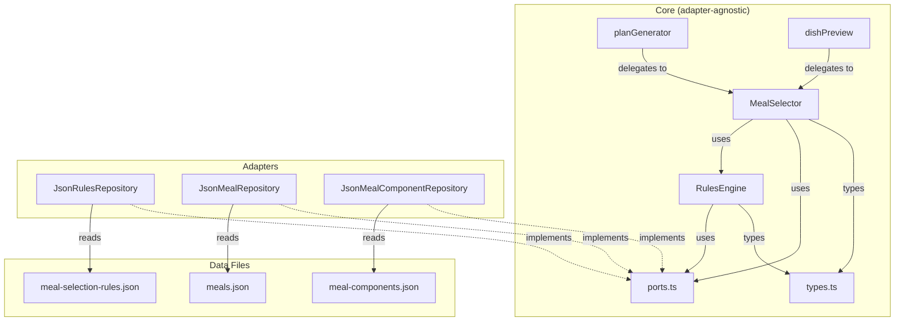
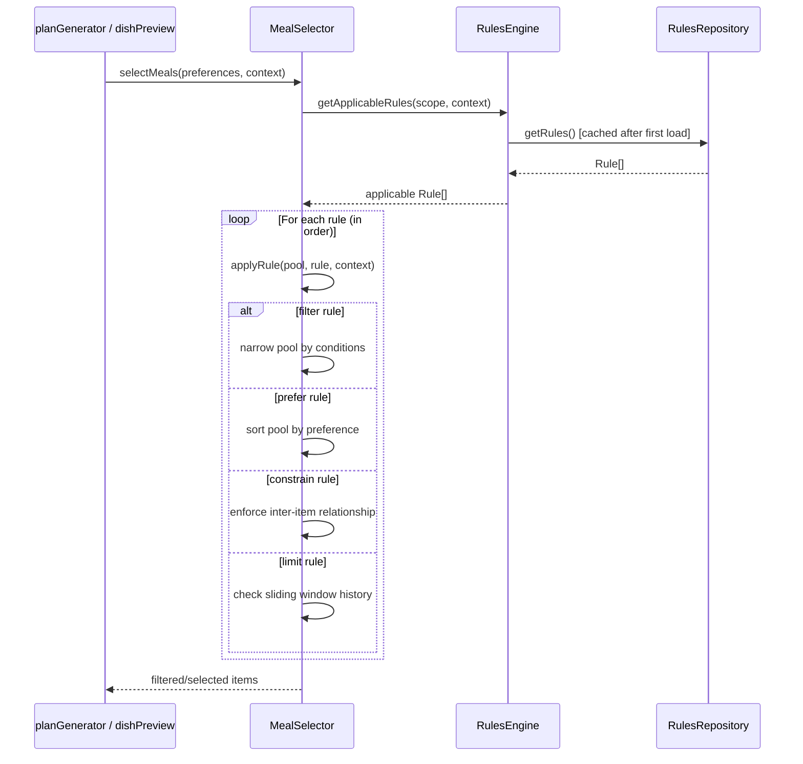

# Design Document: Meal Selection Rules Engine

## Overview

This design externalizes the meal selection constraints currently hardcoded in `planGenerator.ts` and `dishPreview.ts` into a declarative JSON rules file (`data/meal-selection-rules.json`). A lightweight rules engine module loads, validates, and evaluates these rules at runtime, replacing the scattered conditional logic with a single, human-readable configuration surface.

The rules engine integrates through the existing ports-and-adapters architecture: a new `RulesRepository` port provides the rules file, and the core `MealSelector` module consumes it without knowing whether rules come from a local JSON file, a database, or any other source.

Key design decisions:
- **JSON over DSL**: JSON is universally understood, requires no custom parser, and is natively supported by TypeScript. A custom DSL would add complexity without proportional benefit for the ~10–15 rules we need.
- **Sequential filter pipeline**: Rules are evaluated in declaration order. Filter rules narrow the pool (intersection), prefer rules sort without excluding, constrain rules enforce inter-item relationships, and limit rules track history windows. This matches the existing logic flow.
- **Progressive relaxation preserved**: The current codebase relaxes constraints when pools are too small. The rules engine preserves this by attempting strict evaluation first, then relaxing constraints in a defined order — matching the existing multi-pass approach in `pickComponent`.

## Architecture



### Evaluation Flow



## Components and Interfaces

### 1. `RulesRepository` Port (in `ports.ts`)

```typescript
export interface RulesRepository {
  getRules(): Promise<Rule[]>;
}
```

A minimal port. The adapter handles file I/O, parsing, and caching. The core only sees typed `Rule` objects.

### 2. `JsonRulesRepository` Adapter (in `adapters/jsonRulesRepository.ts`)

Reads `data/meal-selection-rules.json`, parses it, validates schema, and caches the result. Throws descriptive errors for missing files, invalid JSON, or schema violations.

### 3. `RulesEngine` (in `core/rulesEngine.ts`)

Responsible for:
- **Loading & validation**: Validates each rule has required fields (`id`, `name`, `description`, `action`), checks for duplicate IDs, and verifies action types and scope values are recognized.
- **Rule lookup**: Given a scope and evaluation context, returns the ordered list of applicable rules.
- **Serialization round-trip**: `parseRules(json: string): Rule[]` and `serializeRules(rules: Rule[]): string` for programmatic read/write.

### 4. `MealSelector` (in `core/mealSelector.ts`)

The orchestrator that replaces the inline filtering logic in `planGenerator.ts` and `dishPreview.ts`. It:
- Accepts a `RulesRepository` (and existing `MealRepository`, `MealComponentRepository`) via dependency injection.
- Applies rules in sequence to build candidate pools.
- Tracks sliding-window history and same-day state for constraint evaluation.
- Implements progressive relaxation: if a strict pass yields zero candidates, it retries with relaxed constraints.

### 5. Updated `planGenerator.ts` and `dishPreview.ts`

These modules delegate filtering and constraint logic to `MealSelector` instead of implementing it inline. The `composeMeal` function signature gains an optional `MealSelector` parameter; when provided, it uses rule-based selection instead of hardcoded `pickComponent`.

## Data Models

### Rule Schema

```typescript
/** Action types supported by the rules engine */
type RuleAction = 'filter' | 'prefer' | 'constrain' | 'limit';

/** Scopes a rule can target */
type RuleScope = 'breakfast' | 'lunch_component' | 'dinner_component' | 'all_slots';

/** A single rule definition as stored in the rules file */
interface Rule {
  id: string;                          // Unique identifier, e.g. "cuisine-filter"
  name: string;                        // Human-readable label
  description: string;                 // Plain-English explanation for non-coders
  scope: RuleScope;                    // What this rule applies to
  categories?: ComponentCategory[];    // Optional: specific categories (base, gravy, etc.)
  action: RuleAction;                  // What the rule does
  conditions: RuleConditions;          // When the rule activates
  parameters?: Record<string, unknown>;// Action-specific config (threshold, windowSize, etc.)
}

/** Conditions that determine when a rule activates */
interface RuleConditions {
  /** User preference field this rule checks (cuisine, diet, style) */
  preferenceField?: 'cuisine' | 'diet' | 'style';
  /** The preference value(s) that activate this rule */
  preferenceValues?: string[];
  /** For constrain rules: which relationship to enforce */
  constraintType?: 'same_day_dedup' | 'ingredient_overlap' | 'cuisine_alternation';
  /** For limit rules: the sliding window configuration */
  windowSize?: number;
  /** For filter rules with whitelists */
  whitelist?: string[];
  /** For ingredient overlap: key ingredient keywords */
  keyIngredients?: string[];
}

/** Evaluation context passed at runtime */
interface RuleEvaluationContext {
  userPreferences: {
    cuisine: 'north_indian' | 'south_indian' | 'both';
    diet: 'veg' | 'non_veg' | 'both';
    style: 'health' | 'regular';
  };
  excludedDishIds: string[];
  slot: 'breakfast' | 'lunch' | 'dinner';
  dayIndex: number;
  /** Sliding window history: category -> recent item IDs */
  history: Record<string, string[]>;
  /** Same-day selections from the other slot */
  sameDaySelections: Record<string, string[]>;
}
```

### Example Rules File Structure

```json
[
  {
    "id": "cuisine-filter",
    "name": "Cuisine Preference Filter",
    "description": "Only include meals and components that match the user's cuisine preference. When the user likes both cuisines, all items are included.",
    "scope": "all_slots",
    "action": "filter",
    "conditions": {
      "preferenceField": "cuisine"
    }
  },
  {
    "id": "diet-filter",
    "name": "Diet Preference Filter",
    "description": "Only include meals and components that match the user's diet preference. When the user likes both diets, all items are included.",
    "scope": "all_slots",
    "action": "filter",
    "conditions": {
      "preferenceField": "diet"
    }
  },
  {
    "id": "diet-fallback",
    "name": "Diet Fallback for Non-Veg Users",
    "description": "Non-vegetarian users also see all vegetarian dishes to give them more variety.",
    "scope": "all_slots",
    "action": "filter",
    "conditions": {
      "preferenceField": "diet",
      "preferenceValues": ["non_veg"]
    },
    "parameters": {
      "includeFallback": "veg"
    }
  },
  {
    "id": "style-filter",
    "name": "Style Preference Filter",
    "description": "Only include meals and components that match the user's style preference (health or regular).",
    "scope": "all_slots",
    "action": "filter",
    "conditions": {
      "preferenceField": "style"
    }
  },
  {
    "id": "style-fallback",
    "name": "Style Fallback for Health Users",
    "description": "When a user prefers healthy meals but a food category has fewer than 2 healthy options, regular options are added with a '(Regular)' label so the user still has enough variety.",
    "scope": "lunch_component",
    "action": "filter",
    "conditions": {
      "preferenceField": "style",
      "preferenceValues": ["health"]
    },
    "parameters": {
      "threshold": 2,
      "fallbackStyle": "regular",
      "labelSuffix": "(Regular)"
    }
  },
  {
    "id": "excluded-dishes",
    "name": "Excluded Dishes Filter",
    "description": "Dishes that the user has previously removed are excluded from all future selections.",
    "scope": "all_slots",
    "action": "filter",
    "conditions": {}
  },
  {
    "id": "south-indian-crossover",
    "name": "South Indian Crossover Filter",
    "description": "When the user likes both cuisines, include all North Indian dishes but only popular South Indian crossover dishes like Idli, Dosa, Uttapam, and Sambhar — not the full traditional South Indian menu.",
    "scope": "all_slots",
    "action": "filter",
    "conditions": {
      "preferenceField": "cuisine",
      "preferenceValues": ["both"],
      "whitelist": [
        "Idli", "Dosa", "Rava Dosa", "Masala Dosa", "Uttapam", "Vegetable Appe"
        "Sambar", "Sambhar", "Idli with Sambar", "Medu Vada with Sambar",
        "Ragi Dosa", "Egg Dosa", "Egg Uttapam"
      ]
    }
  },
  {
    "id": "sliding-window",
    "name": "Variety Sliding Window",
    "description": "Prevents the same dish or component from repeating within a 3-day window, so the weekly plan has good variety. If all options have been used recently, the constraint is relaxed.",
    "scope": "all_slots",
    "action": "limit",
    "conditions": {
      "windowSize": 3
    }
  },
  {
    "id": "same-day-dedup",
    "name": "Same-Day Deduplication",
    "description": "The same dish component should not appear in both lunch and dinner on the same day. If no alternatives exist, the constraint is relaxed.",
    "scope": "lunch_component",
    "action": "constrain",
    "conditions": {
      "constraintType": "same_day_dedup"
    }
  },
  {
    "id": "ingredient-overlap",
    "name": "Ingredient Overlap Avoidance",
    "description": "Two components in the same meal should not share key ingredients like chicken, egg, fish, paneer, cauliflower, spinach, or okra. This ensures each meal has ingredient diversity.",
    "scope": "lunch_component",
    "action": "constrain",
    "conditions": {
      "constraintType": "ingredient_overlap",
      "keyIngredients": [
        "chicken", "egg", "fish", "paneer", "cauliflower", "spinach",
        "okra", "lauki", "ridge_gourd", "brinjal", "cabbage",
        "drumstick", "banana_flower", "parwal", "tinda", "ash_gourd", "raw_banana"
      ]
    }
  },
  {
    "id": "cuisine-alternation",
    "name": "Cuisine Alternation",
    "description": "When the user likes both cuisines, alternate between North Indian and South Indian across consecutive days for balanced representation.",
    "scope": "all_slots",
    "action": "constrain",
    "conditions": {
      "constraintType": "cuisine_alternation"
    },
    "parameters": {
      "pattern": "alternate_by_day"
    }
  }
]
```

### Updated Type Exports (in `types.ts`)

The `Rule`, `RuleAction`, `RuleScope`, `RuleConditions`, and `RuleEvaluationContext` types will be added to `src/core/types.ts` alongside the existing types. No existing types are modified.


## Correctness Properties

*A property is a characteristic or behavior that should hold true across all valid executions of a system — essentially, a formal statement about what the system should do. Properties serve as the bridge between human-readable specifications and machine-verifiable correctness guarantees.*

### Property 1: Rules file round-trip

*For any* valid array of Rule objects, serializing them to JSON and then parsing the JSON back should produce an equivalent array of Rule objects.

**Validates: Requirements 11.1, 11.2, 11.3**

### Property 2: Validation rejects missing or empty required fields

*For any* Rule object where at least one required field (`id`, `name`, `description`, or `action`) is missing or empty, the rules engine validation should reject the rules file and report the specific field that failed.

**Validates: Requirements 2.2**

### Property 3: Validation rejects duplicate IDs

*For any* array of Rule objects where at least two rules share the same `id`, the rules engine validation should reject the rules file and report the duplicate ID.

**Validates: Requirements 2.3**

### Property 4: Invalid JSON produces parse error

*For any* string that is not valid JSON, attempting to parse it as a rules file should produce an error that includes the file path.

**Validates: Requirements 2.4**

### Property 5: Filter rules produce only matching items

*For any* pool of Meals or MealComponents and any filter rule targeting a preference field (cuisine, diet, style, or slot), applying the filter should produce a result where every item matches the user's preference value. When the preference is "both", all items should pass through.

**Validates: Requirements 3.1, 3.2, 3.3, 3.4**

### Property 6: Multiple filters compose as intersection

*For any* pool of items and any sequence of filter rules, applying all filters in sequence should produce the same result as intersecting the results of applying each filter independently.

**Validates: Requirements 3.5**

### Property 7: Diet fallback behavior

*For any* pool of MealComponents, when the diet preference is "non_veg" and the diet fallback rule is active, the result should include both veg and non_veg items (if both exist in the pool). When the diet preference is "veg", the result should include only veg items regardless of the fallback rule.

**Validates: Requirements 4.1, 4.2**

### Property 8: Style fallback adds labeled regular items below threshold

*For any* component category pool where the number of health-style items is below the configured threshold, applying the style fallback rule should add regular-style items to the pool, and every added regular item's name should end with the configured label suffix (e.g., "(Regular)").

**Validates: Requirements 5.1, 5.2**

### Property 9: Regular style users don't get style fallback

*For any* pool of MealComponents where the user's style preference is "regular", the style fallback rule should not activate and no items should have the fallback label suffix appended.

**Validates: Requirements 5.4**

### Property 10: Sliding window deprioritizes recent items

*For any* pool of items and a sliding window history of size N, items whose IDs appear in the window should be deprioritized (selected only when no non-window items are available for the category).

**Validates: Requirements 6.1, 6.2**

### Property 11: Progressive relaxation ensures selection always succeeds

*For any* non-empty pool of items and any active constraint (sliding window, same-day dedup, or ingredient overlap), when all candidates violate the constraint, the rules engine should relax the constraint and still return a valid selection rather than failing.

**Validates: Requirements 6.4, 7.2, 8.4**

### Property 12: Same-day dedup excludes lunch selections from dinner

*For any* component selected for lunch on a given day, when the same-day dedup constraint is active, that component's ID should not appear in the strict-pass dinner candidate pool for the same day and same category.

**Validates: Requirements 7.1**

### Property 13: Adjacent components avoid key ingredient overlap

*For any* composed meal produced under the ingredient overlap constraint, the gravy component should not share key ingredients with the base component, and the dry_veggie component should not share key ingredients with the gravy component (unless the constraint was relaxed due to insufficient alternatives).

**Validates: Requirements 8.1, 8.2**

### Property 14: Cuisine assignment matches preference pattern

*For any* 7-day plan, when the user's cuisine preference is "both", consecutive days should have alternating cuisines. When the preference is a single cuisine ("north_indian" or "south_indian"), all days should be assigned that cuisine.

**Validates: Requirements 9.1, 9.2**

### Property 15: Excluded dishes are removed from all pools

*For any* pool of Meals or MealComponents and any exclusion list, the filtered result should contain no items whose IDs appear in the exclusion list, and should contain all items whose IDs do not appear in the exclusion list.

**Validates: Requirements 10.1, 10.2**

### Property 16: South Indian crossover filter

*For any* pool of Meals or MealComponents: when the cuisine preference is "both" and the crossover filter is active, all north_indian items should be included and only south_indian items whose names match the whitelist should be included. When the preference is "south_indian", all south_indian items should be included without whitelist filtering. When the preference is "north_indian", the crossover filter should not remove any items.

**Validates: Requirements 14.1, 14.2, 14.4, 14.5**

### Property 17: Backward compatibility with default rules

*For any* set of user preferences (cuisine, diet, style) and exclusion list, the rules-based MealSelector loaded with the default rules file should produce candidate pools equivalent to those produced by the current hardcoded `generateCandidateDishes` logic.

**Validates: Requirements 12.1, 12.2**

## Error Handling

| Error Scenario | Behavior | User Impact |
|---|---|---|
| Rules file not found | `JsonRulesRepository` throws with descriptive message including file path | Application fails to start with clear error |
| Rules file is not valid JSON | `RulesEngine.parseRules` throws with parse error and file path | Application fails to start with clear error |
| Rule missing required field | `RulesEngine.validate` throws listing the rule index and missing field | Application fails to start with clear error |
| Duplicate rule IDs | `RulesEngine.validate` throws listing the duplicate ID | Application fails to start with clear error |
| Unknown action type | `RulesEngine.validate` throws listing the invalid action | Application fails to start with clear error |
| Unknown scope value | `RulesEngine.validate` throws listing the invalid scope | Application fails to start with clear error |
| Empty pool after all filters | `MealSelector` applies progressive relaxation — removes constraints one at a time until a selection is possible | User gets a valid plan; constraints are best-effort |
| No components in a category | `composeMeal` throws (existing behavior preserved) | Indicates a data problem in `meal-components.json` |

All validation errors are fail-fast at startup. Runtime errors during selection use progressive relaxation to ensure the user always gets a valid plan.

## Testing Strategy

### Dual Testing Approach

This feature requires both unit tests and property-based tests:

- **Unit tests**: Verify specific examples (e.g., loading the default rules file, specific validation error messages), edge cases (empty rules file, single-rule file), and integration points (MealSelector with real data files).
- **Property tests**: Verify universal properties across randomly generated inputs using `fast-check`. Each property test maps to a correctness property above.

### Property-Based Testing Configuration

- **Library**: `fast-check` (already in devDependencies)
- **Runner**: `vitest` with `vitest run`
- **Minimum iterations**: 100 per property (configured via `vitest.config.ts` `fuzz.numRuns`)
- **Tag format**: Each property test must include a comment: `// Feature: meal-selection-rules-engine, Property N: <property text>`
- **Each correctness property is implemented by a single property-based test**

### Test File Organization

| Test File | Scope |
|---|---|
| `tst/core/rulesEngine.test.ts` | Unit tests for loading, validation, parse/serialize |
| `tst/core/rulesEngine.property.test.ts` | Property tests for Properties 1–4 (round-trip, validation) |
| `tst/core/mealSelector.test.ts` | Unit tests for specific filter/constraint scenarios |
| `tst/core/mealSelector.property.test.ts` | Property tests for Properties 5–16 (filtering, constraints, relaxation) |
| `tst/core/backwardCompat.property.test.ts` | Property test for Property 17 (equivalence with hardcoded logic) |
| `tst/adapters/jsonRulesRepository.test.ts` | Unit tests for file loading, missing file, invalid JSON |

### Generators

Property tests will use custom `fast-check` arbitraries:
- `arbRule()`: Generates valid Rule objects with random IDs, names, descriptions, scopes, and actions
- `arbRuleArray()`: Generates arrays of valid rules with unique IDs
- `arbMealComponent()`: Generates MealComponent objects with random cuisine, diet, style, category, and ingredients
- `arbMeal()`: Generates Meal objects with random properties
- `arbUserPreferences()`: Generates random preference combinations
- `arbExclusionList(pool)`: Generates a subset of IDs from a given pool

### Unit Test Focus Areas

- Default rules file loads and validates successfully
- Each validation error case produces the correct error message
- Style fallback label suffix is correctly applied
- South Indian crossover whitelist contains the required entries (Idli, Dosa, Uttapam, Sambhar)
- Integration: `MealSelector` with `JsonRulesRepository` and real data files produces valid plans
