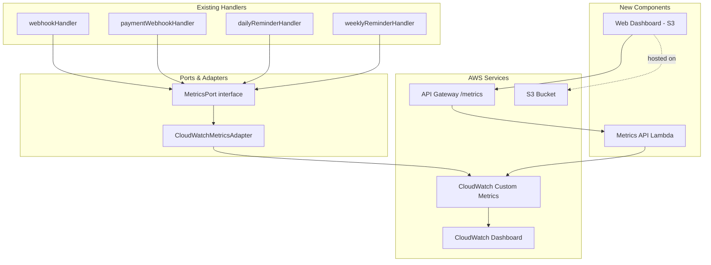

# Design Document: Operational Metrics Dashboard

## Overview

This feature adds an operational metrics dashboard to the Smart Meal Planner WhatsApp bot. It introduces two new components and modifies all existing handlers:

1. A **MetricsPort** interface and **CloudWatchMetricsAdapter** that follow the existing ports-and-adapters pattern, allowing all handlers to emit custom metrics without direct CloudWatch coupling.
2. A **Metrics API** Lambda behind API Gateway that queries CloudWatch `GetMetricData` and returns JSON, consumed by a **static HTML Web Dashboard** hosted on S3.

All metrics are emitted inline at the point of action — no DynamoDB scans or batch collection jobs. Existing handlers (webhookHandler, paymentWebhookHandler, dailyReminderHandler, weeklyReminderHandler) are modified to accept a `MetricsPort` dependency and emit event-level metrics (message received, intent processed, errors, latency, reminders sent, payments, onboarding steps, new users).

The CloudWatch Dashboard is provisioned programmatically via the deploy script alongside existing infrastructure.

## Architecture



### Design Decisions

1. **MetricsPort as a constructor dependency**: Each handler already instantiates its adapters at the top of the handler function. The `CloudWatchMetricsAdapter` will be instantiated alongside existing adapters and passed into business logic functions. For the webhook handler, the metrics port is used directly in the handler wiring layer (not in `botEngine`) since metric emission is an infrastructure concern, not core business logic.

2. **Batch publishing**: The `publishMetrics` method on the port accepts an array of metric data points. The CloudWatch adapter batches these into groups of 25 (the CloudWatch PutMetricData limit per call) for efficiency.

3. **All metrics emitted inline at point of action**: Every metric — including user acquisition (NewUser, OnboardingComplete, OnboardingStep, ReachedPayment), engagement, feature usage, errors, latency, reminders, and payments — is emitted directly in the handler wiring layer when the event occurs. This eliminates the need for DynamoDB scans or batch collection jobs, making the system simpler and more scalable.

4. **Daily Active Users via conditional DynamoDB put**: To get accurate DAU counts without per-user CloudWatch dimensions (which get expensive at scale), the webhook handler performs a conditional `PutItem` to a lightweight Daily_Activity_Table with key `phoneNumber#YYYY-MM-DD`. If the put succeeds (first message of the day for that user), a `DailyActiveUser` metric is emitted. This gives exact DAU with minimal cost — one conditional write per message, but only one metric emission per unique user per day.

5. **Total Users derived from cumulative NewUser count**: The CloudWatch dashboard uses a cumulative SUM of the `NewUser` metric over all time to show total users. No snapshot scan needed.

6. **Web Dashboard with API key auth**: The Metrics API uses a simple shared API key (stored as a Lambda env var) rather than IAM or Cognito, since this is an internal operator tool. The web dashboard stores the key in `localStorage` after first entry.

## Components and Interfaces

### MetricsPort (src/core/ports.ts)

```typescript
export interface MetricDatum {
  name: string;
  value: number;
  unit: 'Count' | 'Milliseconds' | 'None';
  dimensions?: Record<string, string>;
}

export interface MetricsPort {
  publishMetric(name: string, value: number, unit: 'Count' | 'Milliseconds' | 'None', dimensions?: Record<string, string>): Promise<void>;
  publishMetrics(metrics: MetricDatum[]): Promise<void>;
}
```

### CloudWatchMetricsAdapter (src/adapters/cloudwatchMetricsAdapter.ts)

Implements `MetricsPort`. Uses `@aws-sdk/client-cloudwatch` `PutMetricData` API. Publishes to the `SmartMealPlanner` namespace. Batches calls in groups of 25 metric data points.

### Daily Activity Table

A lightweight DynamoDB table used solely for DAU tracking:
- Table name: `MealPlannerDailyActivity-${stage}`
- Partition key: `pk` (string) — value format: `phoneNumber#YYYY-MM-DD`
- No sort key, no GSIs
- TTL attribute: `ttl` (set to 31 days after creation to auto-cleanup old records)
- The webhook handler performs a conditional `PutItem` (condition: `attribute_not_exists(pk)`) on every message. If the put succeeds, it's the user's first message of the day → emit `DailyActiveUser` metric. If it fails with `ConditionalCheckFailedException`, the user was already active today → skip.

### Metrics API (src/handlers/metricsApiHandler.ts)

- Lambda behind API Gateway at `/metrics`
- Accepts `GET` requests with query params: `range` (today, 7d, 30d)
- Validates `x-api-key` header or `apiKey` query parameter against `METRICS_API_KEY` env var
- Queries CloudWatch `GetMetricData` for all metric groups
- Returns JSON response with metric time series data

### Web Dashboard (src/dashboard/index.html)

- Static HTML + vanilla JS (no build step needed)
- Fetches from Metrics API
- Renders charts using Chart.js (loaded from CDN)
- API key prompt on first visit, stored in `localStorage`
- Date range selector: today, last 7 days, last 30 days
- Auto-refresh every 5 minutes (configurable)

### CloudWatch Dashboard (provisioned in deploy.js)

- Created via `CloudWatchClient.putDashboard()` in the deploy script
- 7 widgets matching the 7 metric groups from Requirement 8
- Each widget is a time-series graph with appropriate metrics

### Handler Modifications

Each existing handler gets a `CloudWatchMetricsAdapter` instance and emits metrics:

**webhookHandler.ts**:
- `MessageReceived` (count 1) on every message
- `NewUser` (count 1) when no existing user state found for the phone number
- `DailyActiveUser` (count 1) when conditional put to Daily_Activity_Table succeeds (first message of the day)
- `OnboardingStep` with `Step` dimension when conversationState transitions to an onboarding step
- `OnboardingComplete` (count 1) when response type is `ONBOARDING_COMPLETE`
- `ReachedPayment` (count 1) when conversationState transitions to `awaiting_payment`
- `IntentProcessed` with `IntentName` dimension
- `WebhookLatency` (milliseconds) measuring total processing time
- `WebhookError` (count 1) in the catch block
- `InvalidInput` (count 1) when response type is `INVALID_INPUT`
- Feature usage metrics: `PlanGenerated`, `GroceryListViewed`, `CookMenuSent`, `PlanModified`, `MealSwapped` based on resolved intent

**paymentWebhookHandler.ts**:
- `SubscriptionActivated` (count 1) on `subscription.activated` event
- `PaymentCaptured` (count 1) on `payment.captured` event
- `PaymentWebhookError` (count 1) in the catch block
- `InvalidPaymentSignature` (count 1) on signature verification failure

**dailyReminderHandler.ts**:
- `DailyReminderSent` (count 1) per successful reminder
- `ExpiredPlanPromptSent` (count 1) per expired plan prompt
- `DailyReminderFailure` (count 1) in the per-user catch block

**weeklyReminderHandler.ts**:
- `WeeklyReminderSent` (count 1) per successful reminder
- `WeeklyReminderFailure` (count 1) in the per-user catch block

## Data Models

### MetricDatum (shared type)

```typescript
interface MetricDatum {
  name: string;
  value: number;
  unit: 'Count' | 'Milliseconds' | 'None';
  dimensions?: Record<string, string>;
}
```

### Daily Activity Table Schema

```typescript
// DynamoDB table: MealPlannerDailyActivity-${stage}
interface DailyActivityRecord {
  pk: string;    // `${phoneNumber}#${YYYY-MM-DD}`
  ttl: number;   // Unix timestamp, 31 days from creation
}
```

### Metrics API Response

```typescript
interface MetricsApiResponse {
  range: 'today' | '7d' | '30d';
  generatedAt: string;  // ISO timestamp
  metrics: {
    userAcquisition: TimeSeriesGroup;
    engagement: TimeSeriesGroup;
    featureUsage: TimeSeriesGroup;
    errors: TimeSeriesGroup;
    payments: TimeSeriesGroup;
    reminders: TimeSeriesGroup;
    latency: TimeSeriesGroup;
  };
}

interface TimeSeriesGroup {
  [metricName: string]: {
    timestamps: string[];
    values: number[];
  };
}
```

### CloudWatch Metric Namespace and Dimensions

- Namespace: `SmartMealPlanner`
- Dimensions used:
  - `IntentName` on `IntentProcessed` metric
  - `Step` on `OnboardingStep` metric (values: `awaiting_cuisine`, `awaiting_diet`, `awaiting_meal_style`, `awaiting_meal_format`, `awaiting_payment`)

### Deploy Script Additions

New constants:
```
METRICS_API_FN = `MealPlannerMetricsApi-${stage}`
DASHBOARD_NAME = `SmartMealPlanner-${stage}`
DASHBOARD_BUCKET = `smartmealplanner-dashboard-${stage}`
DAILY_ACTIVITY_TABLE = `MealPlannerDailyActivity-${stage}`
```

New IAM permissions on the Lambda role:
- `cloudwatch:PutMetricData` (for all handlers)
- `cloudwatch:GetMetricData` (for Metrics API)
- `cloudwatch:PutDashboard` (for deploy script)
- `dynamodb:PutItem` on the Daily_Activity_Table (for webhook handler)
- `s3:PutObject` on the dashboard bucket (for deploy script)


## Correctness Properties

*A property is a characteristic or behavior that should hold true across all valid executions of a system — essentially, a formal statement about what the system should do. Properties serve as the bridge between human-readable specifications and machine-verifiable correctness guarantees.*

### Property 1: Webhook handler emits NewUser only for first-time users

*For any* valid webhook event, the metrics port SHALL receive a `NewUser` metric with value 1 if and only if no existing user state was found for the phone number in the User_State_Repository.

**Validates: Requirements 1.1**

### Property 2: Webhook handler emits MessageReceived and IntentProcessed on every message

*For any* valid webhook event that is successfully processed, the metrics port SHALL receive exactly one `MessageReceived` metric with value 1 and exactly one `IntentProcessed` metric with value 1 and an `IntentName` dimension matching the resolved intent.

**Validates: Requirements 2.1, 2.3**

### Property 3: Webhook handler emits correct feature and error metrics based on intent and response type

*For any* valid webhook event, the set of feature-usage metrics emitted (PlanGenerated, GroceryListViewed, CookMenuSent, PlanModified, MealSwapped) SHALL correspond exactly to the intent-to-metric mapping (GENERATE_PLAN → PlanGenerated, VIEW_WEEKLY_GROCERY/VIEW_TOMORROW_GROCERY → GroceryListViewed, SEND_MENU_TO_COOK → CookMenuSent, CHANGE_FEW_MEALS/CHANGE_ENTIRE_PLAN → PlanModified, SWAP_LUNCH → MealSwapped), and an `InvalidInput` metric SHALL be emitted if and only if the response type is INVALID_INPUT.

**Validates: Requirements 3.1, 3.2, 3.3, 3.4, 3.5, 4.6**

### Property 4: Webhook handler emits WebhookError on unhandled exceptions

*For any* webhook invocation where processing throws an unhandled error, the metrics port SHALL receive exactly one `WebhookError` metric with value 1.

**Validates: Requirements 4.1**

### Property 5: Reminder handlers emit correct success and failure metrics

*For any* user processed by the Daily or Weekly Reminder Handler, if the reminder is sent successfully the handler SHALL emit the corresponding success metric (`DailyReminderSent`, `WeeklyReminderSent`, or `ExpiredPlanPromptSent`), and if sending fails the handler SHALL emit the corresponding failure metric (`DailyReminderFailure` or `WeeklyReminderFailure`).

**Validates: Requirements 4.4, 4.5, 6.1, 6.2, 6.3**

### Property 6: Webhook latency metric is non-negative and always emitted

*For any* webhook invocation that completes (whether successfully or with an error), the metrics port SHALL receive a `WebhookLatency` metric whose value is a non-negative number representing elapsed milliseconds.

**Validates: Requirements 7.1**

### Property 7: CloudWatch adapter batches metrics within PutMetricData limits

*For any* list of MetricDatum passed to `publishMetrics`, the CloudWatch adapter SHALL make ⌈n/25⌉ PutMetricData API calls (where n is the number of metrics), each containing at most 25 metric data points, and every input metric SHALL appear in exactly one call.

**Validates: Requirements 10.3**

### Property 8: Metrics API rejects unauthenticated requests

*For any* request to the Metrics API that does not include a valid API key in the `x-api-key` header or `apiKey` query parameter, the API SHALL return a 401 status code.

**Validates: Requirements 11.2**

## Error Handling

### MetricsCollector Errors
- If the DynamoDB scan fails, the MetricsCollector logs the error with the table name and error message, then re-throws to let Lambda report the failure to EventBridge.
- If `publishMetrics` fails, the error is logged with the count of metrics that failed to publish. The collector does not retry — CloudWatch metric gaps are acceptable for a daily dashboard.
- On successful completion, the collector logs the total metrics published and execution duration (Requirement 9.3).

### Handler Metric Emission Errors
- Metric emission in handlers is wrapped in try/catch and failures are logged but **never** propagated. A metric emission failure must not break the user-facing webhook response or reminder delivery.
- Pattern: `try { await metricsPort.publishMetric(...) } catch (e) { console.error('[metrics]', e) }`

### Metrics API Errors
- Invalid or missing API key → 401 Unauthorized with `{ error: 'Unauthorized' }` body.
- Invalid `range` query parameter → 400 Bad Request.
- CloudWatch `GetMetricData` failure → 500 Internal Server Error with logged details.

### CloudWatch Adapter Errors
- `PutMetricData` failures are propagated to the caller. The caller (handler or collector) decides whether to swallow or re-throw.
- Batch calls are sequential — if one batch fails, remaining batches are not attempted (fail-fast).

## Testing Strategy

### Property-Based Testing

Property-based tests use `fast-check` (already a dev dependency) with a minimum of 100 iterations per property. Each test is tagged with a comment referencing the design property.

**Property tests to implement:**

1. **MetricsCollector aggregate counts** (Property 1): Generate random arrays of UserState objects with varying `onboardingComplete`, `conversationState`, `subscription.status`, and `lastActiveAt` values. Run the collector's computation logic (extracted as a pure function) and verify each metric count matches a reference implementation that filters the array.
   - Tag: `Feature: operational-metrics-dashboard, Property 1: MetricsCollector aggregate counts match filter criteria`

2. **Webhook MessageReceived and IntentProcessed emission** (Property 2): Generate random valid webhook events, mock the metrics port, run the handler, and verify the two metrics are always emitted with correct values.
   - Tag: `Feature: operational-metrics-dashboard, Property 2: Webhook handler emits MessageReceived and IntentProcessed on every message`

3. **Webhook feature/error metric mapping** (Property 3): Generate random intents from the defined mapping set, mock the metrics port, and verify the correct feature metric is emitted. Generate intents that produce INVALID_INPUT responses and verify the InvalidInput metric.
   - Tag: `Feature: operational-metrics-dashboard, Property 3: Webhook handler emits correct feature and error metrics based on intent and response type`

4. **Webhook error metric emission** (Property 4): Generate webhook events that cause processing to throw, verify WebhookError is emitted.
   - Tag: `Feature: operational-metrics-dashboard, Property 4: Webhook handler emits WebhookError on unhandled exceptions`

5. **Reminder handler metric emission** (Property 5): Generate random user states, mock messaging provider to succeed or fail, run reminder handlers, verify correct success/failure metrics.
   - Tag: `Feature: operational-metrics-dashboard, Property 5: Reminder handlers emit correct success and failure metrics`

6. **Webhook latency metric** (Property 6): Generate random webhook events, verify WebhookLatency is emitted with a non-negative value.
   - Tag: `Feature: operational-metrics-dashboard, Property 6: Webhook latency metric is non-negative and always emitted`

7. **CloudWatch adapter batching** (Property 7): Generate random arrays of MetricDatum (varying sizes from 0 to 100+), pass to the adapter with a mocked CloudWatch client, verify the number of PutMetricData calls and that all metrics appear exactly once.
   - Tag: `Feature: operational-metrics-dashboard, Property 7: CloudWatch adapter batches metrics within PutMetricData limits`

8. **Metrics API authentication** (Property 8): Generate random strings as API keys (both valid and invalid), send requests to the handler, verify 401 for invalid keys and 200 for valid keys.
   - Tag: `Feature: operational-metrics-dashboard, Property 8: Metrics API rejects unauthenticated requests`

### Unit Tests

Unit tests complement property tests for specific examples and edge cases:

- **MetricsCollector**: Empty user table returns all zeros. Single user in each state produces correct counts.
- **CloudWatch adapter**: Empty metrics array produces zero API calls. Exactly 25 metrics produces one call. 26 metrics produces two calls.
- **Metrics API**: Valid request with each date range returns correct time period. Missing `range` defaults to `today`.
- **Payment webhook metrics**: `subscription.activated` event emits `SubscriptionActivated`. `payment.captured` emits `PaymentCaptured`. Invalid signature emits `InvalidPaymentSignature`.
- **Web Dashboard**: Not unit tested (static HTML). Manual verification.
- **Deploy script dashboard provisioning**: Not unit tested. Verified via deployment.

### Test File Organization

```
tst/
  adapters/
    cloudwatchMetricsAdapter.test.ts          # Unit tests
    cloudwatchMetricsAdapter.property.test.ts  # Property 7
  handlers/
    metricsCollector.property.test.ts          # Property 1
    webhookMetrics.property.test.ts            # Properties 2, 3, 4, 6
    reminderMetrics.property.test.ts           # Property 5
    metricsApi.test.ts                         # Unit tests + Property 8
    paymentWebhookMetrics.test.ts              # Unit tests for payment metrics
```
