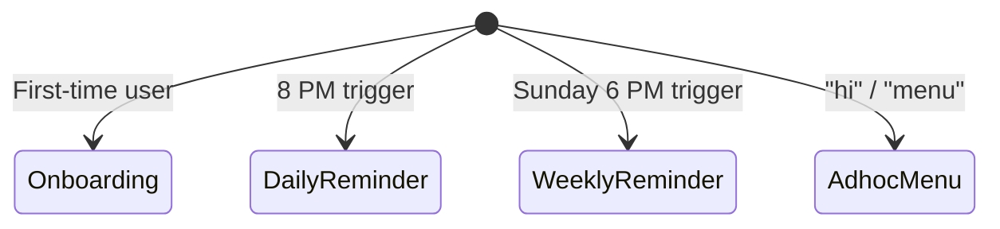
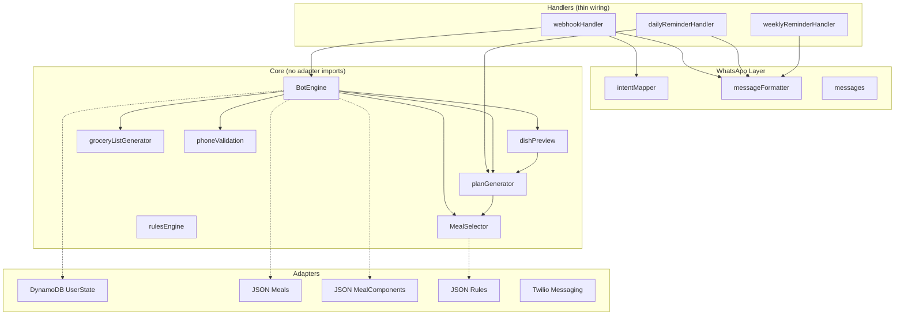
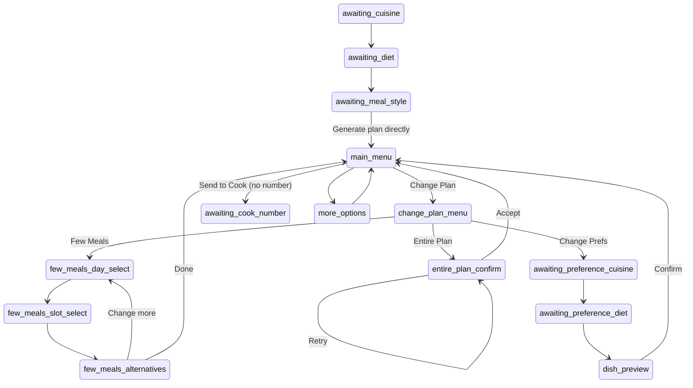

# Design Document: Smart Meal Planner – WhatsApp Flow

## Overview

SmartMealPlanner is a WhatsApp chatbot that generates personalized weekly meal plans, provides grocery lists, sends daily reminders, and allows users to modify their plans. The system follows a structured conversational flow with button-driven navigation — no free text required from the user.

The core architecture is hexagonal: `src/core/` contains all business logic (zero adapter imports), `src/handlers/` are thin wiring layers, `src/adapters/` handle DynamoDB/Twilio/JSON repos, and `src/intentMapper.ts` + `src/messageFormatter.ts` are the WhatsApp-specific translation layers.

## 1. Entry Points

```
ENTRY_POINTS:
  - onboarding (first-time user)
  - daily_reminder (8 PM)
  - weekly_reminder (Sunday 6 PM)
  - adhoc ("hi", "menu")
```



## 2. User State

```typescript
interface UserState {
  phoneNumber: string;
  onboardingComplete: boolean;
  conversationState: ConversationState;

  // Preferences
  cuisinePreference?: 'north_indian' | 'south_indian' | 'both';
  dietPreference?: 'veg' | 'non_veg' | 'both';
  mealStyle?: 'health' | 'regular';

  // Plan
  weeklyPlan?: WeeklyPlan;
  weeklyPlanStartDate?: string;
  excludedDishIds?: string[];

  // Cook
  cookPhoneNumber?: string;

  // Few Meals flow state
  fewMealsSelectedDay?: number;
  fewMealsSelectedSlot?: 'breakfast' | 'lunch' | 'dinner';
  fewMealsAlternatives?: (Meal | ComposedMeal)[];

  // Entire Plan flow state
  previousWeeklyPlan?: WeeklyPlan;

  // Preference change flow state
  isPreferenceChange?: boolean;
  candidateDishes?: CandidateDishes;
  previewStep?: PreviewStep;
}
```

## 3. Onboarding Flow

```
ONBOARDING:
  1. Ask diet → store
  2. Ask style → store
  3. Ask cuisine → store
  4. generateWeeklyPlan(preferences)
  5. Store weeklyPlan
  6. Show weekly plan

  CTA:
    - grocery_list (primary)
    - change_plan
```

### Conversation States

```
awaiting_cuisine → awaiting_diet → awaiting_meal_style → main_menu
```

After the user selects meal style, the bot generates the weekly plan directly and transitions to `main_menu`. No dish preview step. No cook number step during onboarding.

### Handler: `handleAwaitingMealStyle`

On valid `SELECT_MEAL_STYLE`:
1. Generate candidate dishes via `generateCandidateDishes()`
2. Build weekly plan via `buildPlanFromComponents()`
3. Set `onboardingComplete = true`, `conversationState = 'main_menu'`
4. Return `WEEKLY_PLAN` response with `suggestedActions: [grocery_list, change_plan]`

## 4. Weekly Plan View

```
WEEKLY_PLAN_VIEW:
  - Display full week

  CTA:
    - "Happy with the menu" → HAPPY_MENU
    - "Want to change" → CHANGE_PLAN_FLOW
```

### Happy Menu (shared fork after plan approval)

```
HAPPY_MENU:
  OPTIONS:
    - "What's for tomorrow?" → TOMORROW_PLAN (Daily Flow)
    - "Get the grocery list" → WEEKLY_GROCERY (Grocery Flow)
```

The weekly plan shows 7 days (Monday–Sunday), each with breakfast, lunch, and dinner. Lunch and dinner are `ComposedMeal` objects assembled from 4 components: base, gravy, dry_veggie, side.

## 5. Grocery Flow

### Weekly Grocery

```
GROCERY_WEEKLY:
  - Aggregate ingredients from weeklyPlan

  OPTIONS:
    - tomorrow_meals
    - change_plan
```

### Daily Grocery

```
GROCERY_DAILY:
  - Ingredients for next day

  OPTIONS:
    - send_to_cook
    - back
```

Grocery lists are generated by `groceryListGenerator.ts`, grouping ingredients by category with name and quantity.

## 6. Daily Flow (Core Loop)

```
DAILY_REMINDER (8 PM):
  - Fetch tomorrow from weeklyPlan
  - Show meals (breakfast, lunch, dinner)

  OPTIONS:
    - grocery_list
    - send_to_cook
    - change_meal
```

If no plan exists or the plan is expired, the bot prompts the user to generate a new plan.

## 7. Change Plan Flow

```
CHANGE_PLAN:
  Ask intent:

  OPTIONS:
    - few_meals
    - entire_plan
    - preferences
```

### Conversation State: `change_plan_menu`

Routes to the appropriate sub-flow based on user selection.

## 8. Few Meals Flow (Day-wise Replace)

```
FEW_MEALS:
  STEP 1: Select day (Mon–Sun)
  STEP 2: Select meal (breakfast | lunch | dinner)
  STEP 3: generateMeal(slot, context) → show 3 options
  STEP 4: User selects option → update weeklyPlan[day][meal]
  STEP 5: Ask: change_more?

  OPTIONS:
    - yes → repeat flow
    - no → exit
```

### Conversation States

```
few_meals_day_select → few_meals_slot_select → few_meals_alternatives → few_meals_day_select (loop) | main_menu (done)
```

### Handlers

| State | Handler | Behavior |
|-------|---------|----------|
| `few_meals_day_select` | `handleFewMealsDaySelect` | `SELECT_DAY` (payload 0–6) → store day, transition to `few_meals_slot_select` |
| `few_meals_slot_select` | `handleFewMealsSlotSelect` | `SELECT_MEAL_SLOT` → call `generateAlternatives()`, store alternatives, transition to `few_meals_alternatives` |
| `few_meals_alternatives` | `handleFewMealsAlternatives` | `SELECT_ALTERNATIVE` → update plan; `CHANGE_MORE_MEALS` → loop to day select; `DONE_CHANGING` → return to main menu |

### Alternative Generation

`generateAlternatives()` in `planGenerator.ts`:
- Excludes the current meal at that day/slot
- Applies same filters + scoring as plan generation
- Respects same-day dedup against the other slot's components
- Returns up to 3 alternatives
- If no alternatives available, returns `FEW_MEALS_NO_ALTERNATIVE` and routes back to day select

## 9. Entire Plan Flow

```
ENTIRE_PLAN:
  1. Exclude ~70% of current meals
  2. generateWeeklyPlan(preferences, exclusions)
  3. Replace weeklyPlan

  OPTIONS:
    - accept
    - retry (regenerate again)
```

### Conversation State: `entire_plan_confirm`

### Handler: `handleEntirePlanConfirm`

- `ACCEPT_PLAN` → save new plan, clear `previousWeeklyPlan`, return to `main_menu`
- `RETRY_PLAN` → regenerate again with same exclusion logic, stay in `entire_plan_confirm`

### Regeneration Logic

`regenerateWeeklyPlan()` in `planGenerator.ts`:
1. Collect all meal/component IDs from current plan
2. Randomly select ~70% to exclude
3. Filter meals and components by exclusion set
4. If filtering removes too many items, fall back to full pools
5. Generate new plan via `generateWeeklyPlan()`

## 10. Change Preferences

```
PREFERENCES_FLOW:
  1. Ask diet
  2. Ask style
  3. Ask cuisine
  4. Regenerate weeklyPlan
```

### Conversation States

```
awaiting_preference_cuisine → awaiting_preference_diet → dish_preview → main_menu
```

When preferences change:
- `excludedDishIds` is cleared to `[]`
- `isPreferenceChange` flag is set during the flow
- New plan is generated with updated preferences

## 11. Send to Cook

```
SEND_TO_COOK:
  IF cookNumber == null:
    - Ask for number
    - Store cookNumber
  ELSE:
    - Send message: breakfast, lunch, dinner, ingredients

  CONFIRM: sent
```

### Conversation State: `awaiting_cook_number`

Cook number is only requested when the user tries to send to cook and no number is saved. It is NOT part of onboarding.

## 12. Adhoc Menu

```
MENU:
  OPTIONS:
    - weekly_plan
    - tomorrow
    - preferences
```

Triggered by "hi" or "menu" from an onboarded user. Non-onboarded users are routed to onboarding instead.

## 13. Core Generation Logic

```
generateWeeklyPlan(preferences):
  1. Filter dishes (diet + excluded)
  2. Score dishes (cuisine + style)
  3. Build meals:
     - breakfast (single Meal)
     - lunch (base + gravy + dry_veggie + side)
     - dinner (base + gravy + dry_veggie + side)
  4. Apply constraints:
     - no repeat protein (2-day window)
     - same-day dedup (soft)
     - ingredient overlap (soft)
  5. Validate plan:
     - variety
     - no excessive repetition
     - balanced meals
  6. Retry up to 3 times
  7. Return best plan
```

### Constraint Pipeline (in order)

```
Input: All meals/components from repository
  ↓ Cuisine filter (north / south / both→north_indian)
  ↓ Diet filter (veg / non_veg; non_veg includes veg fallback)
  ↓ Style filter (health / regular; bidirectional fallback)
  ↓ Excluded dishes filter
  ↓ Sliding window variety (deprioritize recently used)
  ↓ Same-day deduplication (gravy/dry_veggie not in both lunch+dinner)
  ↓ Ingredient overlap avoidance (no shared key ingredients in same meal)
  ↓ Protein conflict avoidance (no cross-group proteins in same meal)
  ↓ Dual-protein prevention (prefer non-protein dry_veggie when gravy is protein)
  ↓ Cuisine coherence (pure-cuisine base → same-cuisine accompaniments)
Output: Selected meal/component
```

Progressive relaxation: if a constraint leaves zero candidates, it is skipped. Relaxation order: ingredient overlap → sliding window → protein constraints → same-day dedup.

## 14. Replace Meal Logic

```
generateMeal(slot, context):
  1. Exclude current meal
  2. Apply same filters + scoring
  3. Generate 3 alternatives
  4. Apply constraints
  5. Return top 3 options
```

## 15. Core Loop

```
LOOP:
  onboarding
    ↓
  weekly_plan → "Happy with the menu" / "Want to change"
    ↓                                      ↓
  happy_menu                          change_plan
    ├─ "What's for tomorrow?" → daily_flow
    └─ "Get the grocery list" → grocery_flow
    ↓
  daily_reminder
    ↓
  tomorrow_plan
    ↓
  cook / change
    ↓
  repeat (weekly_reminder → weekly_plan → same flow)
```

## 16. Design Constraints

- Max 3 options per step
- No free text required
- Always guide next action
- Prefer replace over full customization
- Daily flow = execution
- Weekly flow = planning
- Every terminal message includes footer: `Type "hi" to start a new conversation`

## Architecture



## Conversation State Machine



## Intents

```typescript
enum Intent {
  // Onboarding
  SELECT_CUISINE, SELECT_DIET, SELECT_MEAL_STYLE,

  // Main menu actions
  GENERATE_PLAN, VIEW_WEEKLY_GROCERY, VIEW_TOMORROW_PLAN,
  VIEW_TOMORROW_GROCERY, SEND_MENU_TO_COOK, SWAP_LUNCH,
  SAVE_COOK_NUMBER, MORE_OPTIONS,

  // Change plan
  CHANGE_PLAN, CHANGE_FEW_MEALS, CHANGE_ENTIRE_PLAN, CHANGE_PREFERENCE,

  // Few meals
  SELECT_DAY, SELECT_MEAL_SLOT, SELECT_ALTERNATIVE,
  CHANGE_MORE_MEALS, DONE_CHANGING,

  // Entire plan
  ACCEPT_PLAN, RETRY_PLAN,

  // Plan approval
  HAPPY_WITH_MENU,

  // Cook
  PROVIDE_COOK_NUMBER, SKIP_COOK_NUMBER,

  // Adhoc
  ADHOC_MENU,

  // Dish preview (preference change only)
  NEXT_CATEGORY, CONFIRM_DISHES, REMOVE_DISH,

  // Fallback
  UNKNOWN,
}
```

## Response Types

```typescript
enum ResponseType {
  // Onboarding
  ONBOARDING_CUISINE_PROMPT, ONBOARDING_DIET_PROMPT, ONBOARDING_STYLE_PROMPT,

  // Plan display
  WEEKLY_PLAN, TOMORROW_PLAN, DAILY_REMINDER,

  // Grocery
  WEEKLY_GROCERY_LIST, TOMORROW_GROCERY_LIST,

  // Change plan
  CHANGE_PLAN_MENU,
  FEW_MEALS_DAY_PROMPT, FEW_MEALS_SLOT_PROMPT,
  FEW_MEALS_ALTERNATIVES, FEW_MEALS_UPDATED, FEW_MEALS_NO_ALTERNATIVE,
  ENTIRE_PLAN_PREVIEW,
  HAPPY_MENU,

  // Cook
  COOK_NUMBER_PROMPT, COOK_NUMBER_SAVED, COOK_MESSAGE_SENT,

  // Adhoc
  ADHOC_MENU,

  // Dish preview (preference change)
  DISH_PREVIEW,

  // Errors
  INVALID_INPUT, INVALID_PHONE, NO_PLAN_ERROR, EXPIRED_PLAN_PROMPT,
  SWAP_CONFIRMATION, SWAP_NO_ALTERNATIVE,
  MAIN_MENU,
}
```

## Error Handling

| Error Condition | Handling |
|----------------|----------|
| Unknown intent in any state | Return `INVALID_INPUT` with valid options; state unchanged |
| Missing user state | Create default state, route to onboarding |
| Invalid phone number | Return `INVALID_PHONE`, re-prompt; state unchanged |
| No weekly plan when action requires it | Return `NO_PLAN_ERROR` with generate plan button |
| Expired plan | Return `EXPIRED_PLAN_PROMPT` with generate plan button |
| No cook number when sending | Prompt for cook number (transition to `awaiting_cook_number`) |
| Empty component pool | Throw error (should not happen with valid data) |
| All constraints eliminate candidates | Progressive relaxation |
| No alternatives for swap | Return `FEW_MEALS_NO_ALTERNATIVE`, route to day select |

## Correctness Properties

### Property 1: New user routing
For any phone number with no state and any message, `processIntent` returns `ONBOARDING_CUISINE_PROMPT` and sets state to `awaiting_cuisine`.

### Property 3: Invalid input re-prompting
For any active-flow state and `UNKNOWN` intent, response is `INVALID_INPUT` and state unchanged.

### Property 4: Weekly plan structural invariant
For any valid preferences, generated plan has 7 days (Mon–Sun) with breakfast (Meal), lunch (ComposedMeal, 4 components), dinner (ComposedMeal, 4 components).

### Property 5: Plan respects preferences
For any generated plan, all meals match user's cuisine, diet, and style preferences.

### Property 6: Plan display completeness
For any plan, formatted output contains every meal name.

### Property 10: Few meals replacement correctness
For any alternative selection, plan is updated at correct day/slot and all other entries unchanged.

### Property 12: Entire plan regeneration exclusion
For any current plan, regenerated plan excludes ≥50% of original meal IDs.

### Property 15: Preference change clears exclusions
For any preference change, `excludedDishIds` is empty and plan matches new preferences.

### Property 16: Grocery list completeness
For any set of meals, grocery list contains every unique ingredient name.

### Property 20: State persistence round-trip
For any `UserState`, serialize then deserialize produces equivalent state.

### Property 22: Constraint pipeline never fails
For any preferences and non-empty pool, generation always returns a result.

### Property 23: Same-day deduplication
For any generated DayPlan, gravy/dry_veggie IDs don't repeat across lunch and dinner.
