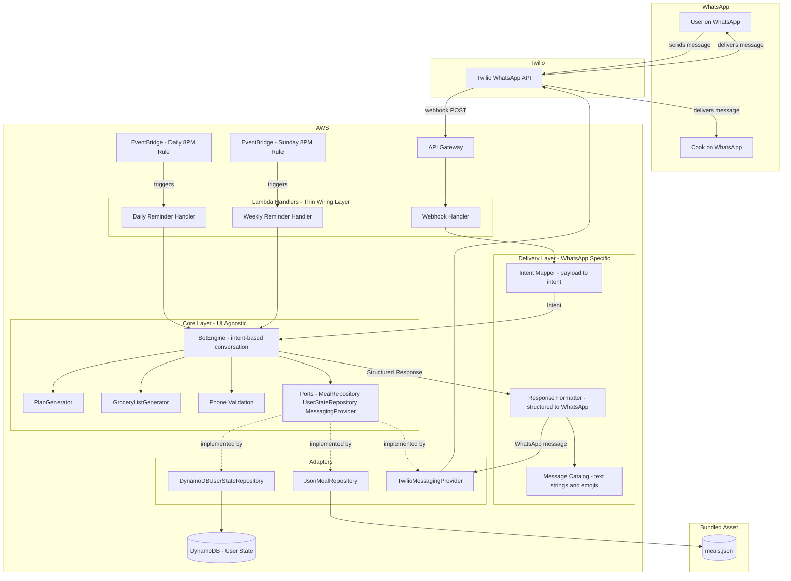
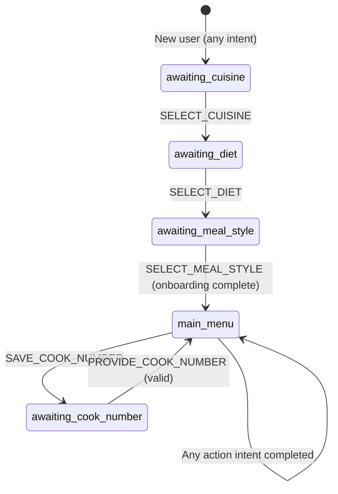

# Design Document: WhatsApp Meal Planner Bot

## Overview

SmartMealPlanner-Bot is a conversational meal planner bot with a delivery-channel-agnostic core. The initial delivery channel is WhatsApp (via Twilio), but the architecture is designed so that a mobile app or web app can reuse the same core business logic with zero changes — only new adapters and a delivery-channel mapping layer are needed.

The core layer contains all business logic: plan generation, grocery list generation, swap logic, phone validation, and an intent-based conversation engine (BotEngine). It depends only on port interfaces (MealRepository, UserStateRepository, MessagingProvider), never on concrete implementations. The WhatsApp/Twilio layer is a thin adapter that maps WhatsApp button payloads to intents, and maps structured responses to WhatsApp messages.

The system is hosted on AWS Lambda behind API Gateway, receiving incoming WhatsApp messages via a Twilio webhook. Two EventBridge scheduled rules trigger reminders: a daily 8 PM cron sends tomorrow's meal plan, and a weekly Sunday 8 PM cron prompts users to generate a fresh weekly plan.

### Key Design Decisions

1. **Ports and Adapters (Hexagonal Architecture)**: The core business logic depends only on port interfaces (`MealRepository`, `UserStateRepository`, `MessagingProvider`). Concrete adapters (`JsonMealRepository`, `DynamoDBUserStateRepository`, `TwilioMessagingProvider`) implement these ports. A future mobile app would provide its own adapters (e.g., `RestApiMealRepository`, `PostgresUserStateRepository`, `PushNotificationProvider`) with zero changes to the core.
2. **Intent-Based Interaction Model**: User interactions are modeled as named intents (`SELECT_CUISINE`, `GENERATE_PLAN`, `SWAP_LUNCH`, etc.) rather than being coupled to WhatsApp button payloads. The WhatsApp delivery layer maps button payloads to intents; a future app would map UI button taps to the same intents.
3. **Structured Response Model**: The core returns structured response objects (`BotResponse` with response type, data payload, and suggested actions) — not formatted WhatsApp messages. The delivery layer formats these into channel-specific output (WhatsApp messages with emojis/buttons, or JSON API responses, or push notifications).
4. **Meal Data Abstraction**: A `MealRepository` interface abstracts meal data access. The initial implementation reads from a static JSON file. This can be swapped to an AI-powered meal suggestion engine or a database without touching core logic.
5. **State Machine Conversation Model**: User conversations are modeled as a finite state machine with well-defined states (onboarding steps, main menu, awaiting input). The BotEngine processes intents and produces structured responses — it has no knowledge of WhatsApp.
6. **DynamoDB for State**: User state is persisted in a single DynamoDB table keyed by phone number, keeping the infrastructure simple and serverless-friendly.
7. **AWS Lambda + API Gateway**: Fully serverless hosting. The webhook handler runs as a Lambda function behind API Gateway. Reminder handlers are separate Lambda functions triggered by EventBridge scheduled rules. AWS account: `713170882602`.
8. **Environment Separation**: Two fully isolated environments (dev and prod) with environment-suffixed resource names, separate Twilio credentials, and independent API Gateway stages.

## Architecture



### Request Flow

1. User sends a WhatsApp message → Twilio forwards it as an HTTP POST to the API Gateway endpoint
2. API Gateway invokes the Webhook Handler Lambda
3. Lambda extracts sender number, message body, and button callback data from the Twilio request
4. **Intent Mapper** converts the WhatsApp-specific payload into a channel-agnostic `UserIntent` (e.g., button payload `"weekly_plan"` → `Intent.GENERATE_PLAN`)
5. **BotEngine** loads user state via `UserStateRepository` port, processes the intent, performs actions (generate plan, build grocery list, etc.), and produces a `BotResponse` (structured data, not formatted text)
6. **Response Formatter** converts the `BotResponse` into WhatsApp-formatted messages using the `MessageCatalog`, then sends via `MessagingProvider` port (resolved to `TwilioMessagingProvider`)
7. Updated user state is persisted via `UserStateRepository` port
8. Lambda returns 200 to API Gateway → Twilio

### Future Delivery Channel Flow (e.g., Mobile App)

1. Mobile app sends an HTTP request to a REST API endpoint
2. API handler extracts the user ID and action from the request body
3. **App Intent Mapper** converts the app-specific request into the same `UserIntent`
4. **BotEngine** processes the intent identically — same code path as WhatsApp
5. **App Response Formatter** converts the `BotResponse` into a JSON API response (no emojis, no WhatsApp formatting)
6. No changes to core layer, BotEngine, PlanGenerator, GroceryListGenerator, or any port interfaces

## Folder Structure

```
src/
  core/                          # Pure business logic, zero external dependencies
    types.ts                     # All shared interfaces and types
    ports.ts                     # MealRepository, UserStateRepository, MessagingProvider interfaces
    planGenerator.ts             # generateWeeklyPlan, extractTomorrowPlan, swapTomorrowLunch
    groceryListGenerator.ts      # generateGroceryList
    phoneValidation.ts           # validatePhoneNumber
    botEngine.ts                 # Intent-based conversation engine (processes intents, returns structured responses)
  adapters/                      # Concrete implementations of ports
    jsonMealRepository.ts        # MealRepository → reads from data/meals.json
    dynamodbUserStateRepository.ts  # UserStateRepository → AWS DynamoDB
    twilioMessagingProvider.ts   # MessagingProvider → Twilio WhatsApp API
  messages.ts                    # Message catalog (text strings, emojis, template SIDs)
  messageFormatter.ts            # Formats structured BotResponses into WhatsApp text
  intentMapper.ts                # Maps WhatsApp button payloads to core Intents
  handlers/                      # Lambda entry points (thin wiring layer)
    webhookHandler.ts
    dailyReminderHandler.ts
    weeklyReminderHandler.ts
  config.ts                      # Environment configuration
data/
  meals.json                     # Meal database
```

## Components and Interfaces

### 1. Port Interfaces (`src/core/ports.ts`)

All port interfaces live in the core layer. The core depends only on these — never on concrete implementations.

#### MessagingProvider (Port)

Abstracts all outbound messaging. The core uses this to send messages without knowing the delivery channel.

```typescript
// src/core/ports.ts

interface ButtonOption {
  id: string;
  title: string;
}

interface MessagingProvider {
  sendTextMessage(to: string, body: string): Promise<void>;
  sendButtonMessage(to: string, body: string, buttons: ButtonOption[], templatePurpose?: string): Promise<void>;
}
```

#### MealRepository (Port)

Abstracts meal data access. Enables swapping from static JSON to AI-powered suggestions or a database.

```typescript
// src/core/ports.ts

interface MealRepository {
  getMeals(filter: MealFilter): Promise<Meal[]>;
  getMealById(id: string): Promise<Meal | null>;
}
```

#### UserStateRepository (Port)

Abstracts user state persistence. Enables swapping from DynamoDB to PostgreSQL, Firebase, etc.

```typescript
// src/core/ports.ts

interface UserStateRepository {
  getUser(phoneNumber: string): Promise<UserState | null>;
  saveUser(state: UserState): Promise<void>;
}
```

### 2. Core Types (`src/core/types.ts`)

All shared types live in the core layer with zero external dependencies.

```typescript
// src/core/types.ts

interface Meal {
  id: string;
  name: string;
  cuisine: 'north_indian' | 'south_indian';
  diet: 'veg' | 'non_veg';
  style: 'health' | 'regular';
  slots: ('breakfast' | 'lunch' | 'dinner')[];
  ingredients: Ingredient[];
}

interface Ingredient {
  name: string;
  quantity: string;
  category: string; // e.g., "vegetables", "dairy", "spices", "grains"
}

interface MealFilter {
  cuisine?: 'north_indian' | 'south_indian' | 'both';
  diet?: 'veg' | 'non_veg';
  style?: 'health' | 'regular';
  slot?: 'breakfast' | 'lunch' | 'dinner';
}

interface DayPlan {
  day: string; // "Monday" through "Sunday"
  breakfast: Meal;
  lunch: Meal;
  dinner: Meal;
}

type WeeklyPlan = DayPlan[];

interface GroceryItem {
  name: string;
  quantity: string;
  category: string;
}

type ConversationState =
  | 'awaiting_cuisine'
  | 'awaiting_diet'
  | 'awaiting_meal_style'
  | 'main_menu'
  | 'awaiting_cook_number';

interface UserState {
  phoneNumber: string;          // partition key
  onboardingComplete: boolean;
  conversationState: ConversationState;
  cuisinePreference?: 'north_indian' | 'south_indian' | 'both';
  dietPreference?: 'veg' | 'non_veg';
  mealStyle?: 'health' | 'regular';
  weeklyPlan?: WeeklyPlan;
  weeklyPlanStartDate?: string; // ISO date of the Monday the plan starts
  cookPhoneNumber?: string;
}
```

### 3. Intent Model (`src/core/types.ts`)

User interactions are modeled as named intents, decoupled from any delivery channel payload format.

```typescript
// src/core/types.ts

enum Intent {
  // Onboarding intents
  SELECT_CUISINE = 'SELECT_CUISINE',
  SELECT_DIET = 'SELECT_DIET',
  SELECT_MEAL_STYLE = 'SELECT_MEAL_STYLE',

  // Main menu action intents
  GENERATE_PLAN = 'GENERATE_PLAN',
  VIEW_WEEKLY_GROCERY = 'VIEW_WEEKLY_GROCERY',
  VIEW_TOMORROW_PLAN = 'VIEW_TOMORROW_PLAN',
  VIEW_TOMORROW_GROCERY = 'VIEW_TOMORROW_GROCERY',
  SEND_MENU_TO_COOK = 'SEND_MENU_TO_COOK',
  SWAP_LUNCH = 'SWAP_LUNCH',
  SAVE_COOK_NUMBER = 'SAVE_COOK_NUMBER',

  // Input intents
  PROVIDE_COOK_NUMBER = 'PROVIDE_COOK_NUMBER',

  // Fallback
  UNKNOWN = 'UNKNOWN',
}

interface UserIntent {
  intent: Intent;
  payload?: string; // e.g., cuisine value, phone number, etc.
}
```

### 4. Structured Response Model (`src/core/types.ts`)

The core returns structured response objects — not formatted text. The delivery layer formats these for the specific channel.

```typescript
// src/core/types.ts

enum ResponseType {
  ONBOARDING_CUISINE_PROMPT = 'ONBOARDING_CUISINE_PROMPT',
  ONBOARDING_DIET_PROMPT = 'ONBOARDING_DIET_PROMPT',
  ONBOARDING_STYLE_PROMPT = 'ONBOARDING_STYLE_PROMPT',
  ONBOARDING_COMPLETE = 'ONBOARDING_COMPLETE',
  MAIN_MENU = 'MAIN_MENU',
  WEEKLY_PLAN = 'WEEKLY_PLAN',
  WEEKLY_GROCERY_LIST = 'WEEKLY_GROCERY_LIST',
  TOMORROW_PLAN = 'TOMORROW_PLAN',
  TOMORROW_GROCERY_LIST = 'TOMORROW_GROCERY_LIST',
  COOK_NUMBER_PROMPT = 'COOK_NUMBER_PROMPT',
  COOK_NUMBER_SAVED = 'COOK_NUMBER_SAVED',
  COOK_MESSAGE_SENT = 'COOK_MESSAGE_SENT',
  SWAP_CONFIRMATION = 'SWAP_CONFIRMATION',
  NO_PLAN_ERROR = 'NO_PLAN_ERROR',
  NO_COOK_ERROR = 'NO_COOK_ERROR',
  INVALID_INPUT = 'INVALID_INPUT',
  INVALID_PHONE = 'INVALID_PHONE',
  SWAP_NO_ALTERNATIVE = 'SWAP_NO_ALTERNATIVE',
  EXPIRED_PLAN_PROMPT = 'EXPIRED_PLAN_PROMPT',
  DAILY_REMINDER = 'DAILY_REMINDER',
  WEEKLY_REMINDER = 'WEEKLY_REMINDER',
  ERROR = 'ERROR',
}

interface SuggestedAction {
  id: string;
  label: string;
}

interface BotResponse {
  type: ResponseType;
  data?: {
    weeklyPlan?: WeeklyPlan;
    dayPlan?: DayPlan;
    groceryList?: GroceryItem[];
    oldMeal?: string;
    newMeal?: string;
    cookNumber?: string;
    dayName?: string;
  };
  suggestedActions?: SuggestedAction[];
}

interface BotResult {
  response: BotResponse;
  updatedState: UserState;
}
```

### 5. BotEngine (`src/core/botEngine.ts`)

The intent-based conversation engine. Processes `UserIntent` objects and produces `BotResponse` objects. Has zero knowledge of WhatsApp, Twilio, or any delivery channel. Depends only on port interfaces.

```typescript
// src/core/botEngine.ts

function processIntent(
  intent: UserIntent,
  userState: UserState | null,
  mealRepository: MealRepository
): Promise<BotResult>;
```

**State Transitions:**



**Intent Processing Logic:**
- New user (no state) → return `ONBOARDING_CUISINE_PROMPT` with cuisine options as suggested actions
- `awaiting_cuisine` + `SELECT_CUISINE` → store cuisine, return `ONBOARDING_DIET_PROMPT`
- `awaiting_cuisine` + `UNKNOWN` → return `INVALID_INPUT` with cuisine options re-prompted
- `awaiting_diet` + `SELECT_DIET` → store diet, return `ONBOARDING_STYLE_PROMPT`
- `awaiting_meal_style` + `SELECT_MEAL_STYLE` → store style, mark onboarding complete, return `ONBOARDING_COMPLETE` then `MAIN_MENU`
- `main_menu` + `GENERATE_PLAN` → call `generateWeeklyPlan`, store plan, return `WEEKLY_PLAN` with plan data
- `main_menu` + `VIEW_WEEKLY_GROCERY` → generate grocery list from stored plan, return `WEEKLY_GROCERY_LIST`
- `main_menu` + `VIEW_TOMORROW_PLAN` → extract tomorrow's plan, return `TOMORROW_PLAN`
- `main_menu` + `VIEW_TOMORROW_GROCERY` → extract tomorrow's meals, generate grocery list, return `TOMORROW_GROCERY_LIST`
- `main_menu` + `SEND_MENU_TO_COOK` → send tomorrow's plan to cook, return `COOK_MESSAGE_SENT`
- `main_menu` + `SWAP_LUNCH` → swap tomorrow's lunch, return `SWAP_CONFIRMATION` with old/new meal
- `main_menu` + `SAVE_COOK_NUMBER` → transition to `awaiting_cook_number`, return `COOK_NUMBER_PROMPT`
- `awaiting_cook_number` + `PROVIDE_COOK_NUMBER` → validate, store, return `COOK_NUMBER_SAVED`
- Any state + missing plan when plan is required → return `NO_PLAN_ERROR`
- Any state + missing cook number when cook is required → return `NO_COOK_ERROR`

### 6. Intent Mapper (`src/intentMapper.ts`)

WhatsApp-specific layer that converts Twilio webhook payloads into channel-agnostic `UserIntent` objects.

```typescript
// src/intentMapper.ts

function mapWhatsAppToIntent(
  buttonPayload: string | undefined,
  body: string,
  conversationState: ConversationState
): UserIntent;
```

**Mapping Rules:**
- Button payload `"north_indian"` / `"south_indian"` / `"both"` in `awaiting_cuisine` → `{ intent: SELECT_CUISINE, payload: value }`
- Button payload `"veg"` / `"non_veg"` in `awaiting_diet` → `{ intent: SELECT_DIET, payload: value }`
- Button payload `"health"` / `"regular"` in `awaiting_meal_style` → `{ intent: SELECT_MEAL_STYLE, payload: value }`
- Button payload `"weekly_plan"` → `{ intent: GENERATE_PLAN }`
- Button payload `"weekly_grocery"` → `{ intent: VIEW_WEEKLY_GROCERY }`
- Button payload `"tomorrow_plan"` → `{ intent: VIEW_TOMORROW_PLAN }`
- Button payload `"tomorrow_grocery"` → `{ intent: VIEW_TOMORROW_GROCERY }`
- Button payload `"send_to_cook"` → `{ intent: SEND_MENU_TO_COOK }`
- Button payload `"swap_lunch"` → `{ intent: SWAP_LUNCH }`
- Button payload `"save_cook"` → `{ intent: SAVE_COOK_NUMBER }`
- Free text in `awaiting_cook_number` → `{ intent: PROVIDE_COOK_NUMBER, payload: body }`
- Free text in any button-expected state → `{ intent: UNKNOWN }`

A future mobile app would have its own intent mapper that converts REST API request bodies to the same `UserIntent` objects.

### 7. PlanGenerator (`src/core/planGenerator.ts`)

Generates weekly meal plans respecting user preferences and no-repeat constraints. Pure business logic, no external dependencies.

```typescript
// src/core/planGenerator.ts

function generateWeeklyPlan(
  meals: Meal[],
  preferences: { cuisine: string; diet: string; style: string }
): WeeklyPlan;

function extractTomorrowPlan(
  weeklyPlan: WeeklyPlan,
  weeklyPlanStartDate: string
): DayPlan | null;

function swapTomorrowLunch(
  weeklyPlan: WeeklyPlan,
  tomorrowIndex: number,
  meals: Meal[],
  preferences: { cuisine: string; diet: string; style: string }
): { updatedPlan: WeeklyPlan; oldMeal: string; newMeal: string } | null;
```

**Algorithm:**
1. Filter meals by user preferences via `MealRepository.getMeals()`
2. Group filtered meals by slot compatibility (breakfast, lunch, dinner)
3. For each day, pick a meal for each slot ensuring:
   - No meal repeats within the same day
   - No meal repeats in the same slot on consecutive days
   - When cuisine is "both", distribute North/South Indian meals across days
4. Uses Fisher-Yates shuffle on each slot pool, then assigns sequentially to avoid repetition

### 8. GroceryListGenerator (`src/core/groceryListGenerator.ts`)

Aggregates ingredients from a set of meals into a categorized grocery list. Pure business logic.

```typescript
// src/core/groceryListGenerator.ts

function generateGroceryList(meals: Meal[]): GroceryItem[];
```

- Deduplicates ingredients by name
- Groups by category (vegetables, dairy, spices, grains, etc.)

### 9. Phone Validation (`src/core/phoneValidation.ts`)

Validates cook phone numbers. Pure function, no external dependencies.

```typescript
// src/core/phoneValidation.ts

function validatePhoneNumber(input: string): { valid: boolean; normalized?: string };
```

### 10. MessageCatalog (`src/messages.ts`)

Single source of truth for all user-facing text strings. Lives outside the core layer because it contains WhatsApp-specific formatting (emojis, WhatsApp text formatting). A future mobile app would have its own message catalog or use the structured response data directly.

**Message Groups:**

| Group | Examples |
|---|---|
| Onboarding | Welcome message, cuisine/diet/style prompts, onboarding complete confirmation |
| Main Menu | Menu header, action descriptions |
| Plan | Weekly plan header/footer, day plan header, "no plan" prompts |
| Grocery | Weekly grocery header, tomorrow grocery header, category headers |
| Cook | Cook number prompt, save confirmation, send confirmation, "no cook" prompt |
| Swap | Swap confirmation (`{oldMeal}` → `{newMeal}`), no alternative available |
| Reminders | Daily reminder header, weekly Sunday reminder, expired plan prompt |
| Errors | Invalid input, generic error, invalid phone number, free-text rejection |

**Template Variable Support:**

Messages use named placeholders replaced at runtime:
- `{dayName}` — day of the week
- `{mealName}` — name of a meal
- `{oldMeal}`, `{newMeal}` — for swap confirmations
- `{cookNumber}` — cook's phone number
- `{slot}` — meal slot (breakfast/lunch/dinner)

```typescript
// src/messages.ts — centralized message catalog

// --- Onboarding ---
export const ONBOARDING_WELCOME = `Hey there! 👋 Welcome to SmartMealPlanner!\nLet's set up your preferences so I can plan delicious meals for you 🍽️`;
export const ONBOARDING_CUISINE_PROMPT = `What cuisine do you prefer? 🍛`;
export const ONBOARDING_DIET_PROMPT = `Great choice! Now, what's your diet preference? 🥗`;
export const ONBOARDING_STYLE_PROMPT = `Almost done! What style of meals do you like? 🏠`;
export const ONBOARDING_COMPLETE = `You're all set! 🎉 Here's what you can do:`;

// --- Main Menu ---
export const MAIN_MENU_HEADER = `What would you like to do? 😊`;

// --- Plan ---
export const WEEKLY_PLAN_HEADER = `Here's your meal plan for the week 🍽️\n`;
export const DAY_PLAN_HEADER = (dayName: string) => `Tomorrow's meals (${dayName}) 🌅\n`;
export const NO_PLAN_PROMPT = `You don't have a meal plan yet! Let's generate one first 📋`;

// --- Grocery ---
export const WEEKLY_GROCERY_HEADER = `Here's your grocery list for the week 🛒\n`;
export const TOMORROW_GROCERY_HEADER = `Here's what you need for tomorrow 🛒\n`;

// --- Cook ---
export const COOK_NUMBER_PROMPT = `Please enter your cook's WhatsApp number with country code (e.g., +91XXXXXXXXXX) 📱`;
export const COOK_NUMBER_SAVED = `Cook's number saved successfully ✅`;
export const COOK_MESSAGE_SENT = `Tomorrow's menu has been sent to your cook 👨‍🍳`;
export const NO_COOK_PROMPT = `Please save your cook's number first 📱`;

// --- Swap ---
export const SWAP_CONFIRMATION = (oldMeal: string, newMeal: string) =>
  `Swapped! 🔄\n${oldMeal} ➡️ ${newMeal}`;
export const SWAP_NO_ALTERNATIVE = `Sorry, no alternative lunch is available right now 😕`;

// --- Reminders ---
export const DAILY_REMINDER_HEADER = (dayName: string) =>
  `Hey! Here's your meal plan for tomorrow (${dayName}) 🍽️\n`;
export const WEEKLY_REMINDER = `Hey! 🍽️ Time to plan your meals for the week ahead!`;
export const EXPIRED_PLAN_PROMPT = `Your meal plan has expired. Let's generate a fresh one! 📋`;

// --- Errors ---
export const INVALID_INPUT = `Please select one of the options below 👇`;
export const GENERIC_ERROR = `Something went wrong, please try again 🙏`;
export const INVALID_PHONE = `Please enter a valid WhatsApp number with country code (e.g., +91XXXXXXXXXX) 📱`;
```

**Twilio WhatsApp Content Template SID Mapping:**

The bot uses pre-created Twilio WhatsApp Content Templates for all interactive button messages. Each template is mapped by purpose, with a hardcoded default SID that can be overridden via Lambda environment variables per environment.

| Purpose | Template Name | Default SID | Type | Env Variable |
|---|---|---|---|---|
| Main Menu | `copy_mealplanner_main_menu_without_emoji` | `HXe992435f98fde5249c641a135bb5dbd5` | Quick Reply | `TWILIO_TEMPLATE_SID_MAIN_MENU` |
| Main Menu (button variant) | `mealplanner_main_menu_without_image_button` | `HX050102bc4bf8f0f9a48473db7ea7152e` | Quick Reply | `TWILIO_TEMPLATE_SID_MAIN_MENU_BUTTON` |
| Menu More Options | `copy_mealplanner_menu_more_without_emoji` | `HX7957efc7a19b2b9c8d2910ba15e6a2c5` | Quick Reply | `TWILIO_TEMPLATE_SID_MENU_MORE` |
| Daily Reminder | `copy_mealplanner_daily_reminder_with_example` | `HX708fce9ebb60de686f73731e071aa8cb` | Text | `TWILIO_TEMPLATE_SID_DAILY_REMINDER` |
| Cook Options | `mealplanner_cook_options` | `HX6eddbb2f0eb2678e3f505e3786dec4e8` | Quick Reply | `TWILIO_TEMPLATE_SID_COOK_OPTIONS` |
| Diet Selection | `mealplanner_diet_selection` | `HX5ad138d83501b0b1111e0a19a524dfd5` | Quick Reply | `TWILIO_TEMPLATE_SID_DIET_SELECTION` |
| Cuisine Selection | `mealplanner_cuisine_selection` | `HX62d7649f7e38d88bec1b7d85b25ea83e` | Quick Reply | `TWILIO_TEMPLATE_SID_CUISINE_SELECTION` |
| Meal Style | `mealplanner_meal_style` | `HX26deeadd8ad7de0baf4568365e3da981` | Quick Reply | `TWILIO_TEMPLATE_SID_MEAL_STYLE` |

```typescript
// src/messages.ts — template SID mapping (appended to the message catalog)

export type TemplatePurpose =
  | 'main_menu'
  | 'main_menu_button'
  | 'menu_more'
  | 'daily_reminder'
  | 'cook_options'
  | 'diet_selection'
  | 'cuisine_selection'
  | 'meal_style';

const DEFAULT_TEMPLATE_SIDS: Record<TemplatePurpose, string> = {
  main_menu: 'HXe992435f98fde5249c641a135bb5dbd5',
  main_menu_button: 'HX050102bc4bf8f0f9a48473db7ea7152e',
  menu_more: 'HX7957efc7a19b2b9c8d2910ba15e6a2c5',
  daily_reminder: 'HX708fce9ebb60de686f73731e071aa8cb',
  cook_options: 'HX6eddbb2f0eb2678e3f505e3786dec4e8',
  diet_selection: 'HX5ad138d83501b0b1111e0a19a524dfd5',
  cuisine_selection: 'HX62d7649f7e38d88bec1b7d85b25ea83e',
  meal_style: 'HX26deeadd8ad7de0baf4568365e3da981',
};

const ENV_VAR_MAP: Record<TemplatePurpose, string> = {
  main_menu: 'TWILIO_TEMPLATE_SID_MAIN_MENU',
  main_menu_button: 'TWILIO_TEMPLATE_SID_MAIN_MENU_BUTTON',
  menu_more: 'TWILIO_TEMPLATE_SID_MENU_MORE',
  daily_reminder: 'TWILIO_TEMPLATE_SID_DAILY_REMINDER',
  cook_options: 'TWILIO_TEMPLATE_SID_COOK_OPTIONS',
  diet_selection: 'TWILIO_TEMPLATE_SID_DIET_SELECTION',
  cuisine_selection: 'TWILIO_TEMPLATE_SID_CUISINE_SELECTION',
  meal_style: 'TWILIO_TEMPLATE_SID_MEAL_STYLE',
};

export function getTemplateSid(purpose: TemplatePurpose): string {
  const envVar = ENV_VAR_MAP[purpose];
  return process.env[envVar] || DEFAULT_TEMPLATE_SIDS[purpose];
}
```

The `TwilioMessagingProvider.sendButtonMessage` method uses `getTemplateSid(purpose)` to resolve the correct content SID when calling the Twilio Content API. The `purpose` parameter is passed through from the response formatter, which maps `BotResponse.type` to the appropriate template purpose.

### 11. Response Formatter (`src/messageFormatter.ts`)

WhatsApp-specific layer that converts structured `BotResponse` objects into formatted WhatsApp messages. All text strings are sourced from the MessageCatalog (`src/messages.ts`). A future mobile app would have its own response formatter (or skip formatting entirely and return the structured data as JSON).

```typescript
// src/messageFormatter.ts

interface FormattedMessage {
  text: string;
  buttons?: ButtonOption[];
  templatePurpose?: TemplatePurpose;
}

function formatBotResponse(response: BotResponse): FormattedMessage;
function formatWeeklyPlan(plan: WeeklyPlan): string;
function formatDayPlan(day: DayPlan): string;
function formatGroceryList(items: GroceryItem[]): string;
function formatCookMessage(day: DayPlan): string;
```

**Response Type → WhatsApp Format Mapping:**
- `ONBOARDING_CUISINE_PROMPT` → cuisine prompt text + cuisine buttons (templatePurpose: `'cuisine_selection'`)
- `ONBOARDING_DIET_PROMPT` → diet prompt text + diet buttons (templatePurpose: `'diet_selection'`)
- `ONBOARDING_STYLE_PROMPT` → style prompt text + style buttons (templatePurpose: `'meal_style'`)
- `WEEKLY_PLAN` → formatted weekly plan text + main menu buttons
- `WEEKLY_GROCERY_LIST` → formatted grocery list text + main menu buttons
- `TOMORROW_PLAN` → formatted day plan text + main menu buttons
- `SWAP_CONFIRMATION` → swap confirmation text with old/new meal names + main menu buttons
- `NO_PLAN_ERROR` → "generate plan first" text + generate plan button
- `INVALID_INPUT` → "select an option" text + re-prompt current buttons
- `MAIN_MENU` → menu header + main menu buttons (templatePurpose: `'main_menu'`)
- etc.

### 12. Adapter: JsonMealRepository (`src/adapters/jsonMealRepository.ts`)

Implements `MealRepository` port. Reads from `data/meals.json` at startup, filters in-memory.

```typescript
// src/adapters/jsonMealRepository.ts

class JsonMealRepository implements MealRepository {
  private meals: Meal[];

  constructor(mealsFilePath: string);
  async getMeals(filter: MealFilter): Promise<Meal[]>;
  async getMealById(id: string): Promise<Meal | null>;
}
```

- Reads from `data/meals.json` at startup
- Filters in-memory based on `MealFilter` criteria
- When cuisine filter is "both", return meals from both north_indian and south_indian
- Ingredients are embedded in each meal entry

### 13. Adapter: DynamoDBUserStateRepository (`src/adapters/dynamodbUserStateRepository.ts`)

Implements `UserStateRepository` port. Uses AWS SDK v3 DynamoDB client.

```typescript
// src/adapters/dynamodbUserStateRepository.ts

class DynamoDBUserStateRepository implements UserStateRepository {
  constructor(tableName: string);
  async getUser(phoneNumber: string): Promise<UserState | null>;
  async saveUser(state: UserState): Promise<void>;
}
```

- Uses `phoneNumber` as partition key
- Serializes/deserializes `WeeklyPlan` as a DynamoDB Map
- Table name loaded from `Config.dynamodbTable`

### 14. Adapter: TwilioMessagingProvider (`src/adapters/twilioMessagingProvider.ts`)

Implements `MessagingProvider` port. Uses Twilio SDK for WhatsApp messaging.

```typescript
// src/adapters/twilioMessagingProvider.ts

class TwilioMessagingProvider implements MessagingProvider {
  constructor(accountSid: string, authToken: string, senderNumber: string);
  async sendTextMessage(to: string, body: string): Promise<void>;
  async sendButtonMessage(to: string, body: string, buttons: ButtonOption[], templatePurpose?: string): Promise<void>;
}
```

- When `templatePurpose` is provided, resolves the Twilio Content Template SID via `getTemplateSid(purpose)` from the MessageCatalog and sends using the `contentSid` parameter in the Twilio API call
- Falls back to inline button construction if no template SID is available
- Maps `ButtonOption` to Twilio's interactive message format
- Sends from the configured sender number

### 15. WebhookHandler (`src/handlers/webhookHandler.ts`)

AWS Lambda function behind API Gateway. Thin wiring layer that connects the delivery channel to the core.

```typescript
// src/handlers/webhookHandler.ts
export async function webhookHandler(event: APIGatewayProxyEvent): Promise<APIGatewayProxyResult>;
```

**Responsibilities (wiring only — no business logic):**
1. Parse URL-encoded form body from Twilio to extract `From`, `Body`, and button callback payload
2. Instantiate adapters: `DynamoDBUserStateRepository`, `JsonMealRepository`, `TwilioMessagingProvider`
3. Load user state via `UserStateRepository`
4. Call `intentMapper.mapWhatsAppToIntent()` to convert payload to `UserIntent`
5. Call `botEngine.processIntent()` with the intent and user state
6. Call `messageFormatter.formatBotResponse()` to convert `BotResponse` to WhatsApp format
7. Send formatted message via `MessagingProvider`
8. Save updated state via `UserStateRepository`
9. Return `{ statusCode: 200, body: '' }` to Twilio

### 16. ReminderService (`src/handlers/dailyReminderHandler.ts`, `src/handlers/weeklyReminderHandler.ts`)

Two separate Lambda handlers triggered by EventBridge scheduled rules. These are thin wiring layers that use the core BotEngine to generate responses, then format and send them.

**Daily Reminder Lambda (8 PM every day):**

```typescript
// src/handlers/dailyReminderHandler.ts
export async function dailyReminderHandler(event: ScheduledEvent): Promise<void>;
```

- Scans DynamoDB for all users with `onboardingComplete: true` and an active `weeklyPlan` that covers tomorrow
- For each user: calls BotEngine to produce a `DAILY_REMINDER` response, formats it via `messageFormatter`, sends via `MessagingProvider`
- Includes button message with options: "View Grocery List", "Swap Lunch", "Send to Cook"
- If a user's plan doesn't cover tomorrow (expired), sends an `EXPIRED_PLAN_PROMPT` response instead

**Weekly Reminder Lambda (8 PM every Sunday):**

```typescript
// src/handlers/weeklyReminderHandler.ts
export async function weeklyReminderHandler(event: ScheduledEvent): Promise<void>;
```

- Scans DynamoDB for all users with `onboardingComplete: true`
- For each user: produces a `WEEKLY_REMINDER` response, formats and sends it
- Includes button message with the option: "Generate Weekly Plan"
- Sent regardless of whether the user already has an active plan

## Data Models

### DynamoDB Table: `MealPlannerUsers`

| Attribute | Type | Description |
|---|---|---|
| `phoneNumber` (PK) | String | User's WhatsApp number (e.g., "+919876543210") |
| `onboardingComplete` | Boolean | Whether onboarding flow is finished |
| `conversationState` | String | Current state in the conversation state machine |
| `cuisinePreference` | String | "north_indian", "south_indian", or "both" |
| `dietPreference` | String | "veg" or "non_veg" |
| `mealStyle` | String | "health" or "regular" |
| `weeklyPlan` | Map | The current 7-day meal plan (serialized `WeeklyPlan`) |
| `weeklyPlanStartDate` | String | ISO date string for the Monday the plan covers |
| `cookPhoneNumber` | String | Cook's WhatsApp number |

### Meal Data File: `data/meals.json`

```json
[
  {
    "id": "ni-b-001",
    "name": "Poha",
    "cuisine": "north_indian",
    "diet": "veg",
    "style": "health",
    "slots": ["breakfast"],
    "ingredients": [
      { "name": "Flattened Rice", "quantity": "200g", "category": "grains" },
      { "name": "Onion", "quantity": "1 medium", "category": "vegetables" },
      { "name": "Green Chili", "quantity": "2", "category": "vegetables" },
      { "name": "Peanuts", "quantity": "2 tbsp", "category": "nuts" },
      { "name": "Turmeric", "quantity": "1/2 tsp", "category": "spices" },
      { "name": "Mustard Seeds", "quantity": "1 tsp", "category": "spices" }
    ]
  }
]
```

**ID Convention:** `{cuisine_prefix}-{slot_prefix}-{number}`
- Cuisine: `ni` (North Indian), `si` (South Indian)
- Slot: `b` (breakfast), `l` (lunch), `d` (dinner)
- Meals compatible with multiple slots get the primary slot prefix

**Ingredient Embedding Rationale:** Ingredients are embedded directly in each meal entry rather than in a separate file. This keeps the data self-contained, makes it trivial to add/edit meals (each meal is a complete unit), and avoids cross-reference complexity. When the data source is swapped to an AI provider, the AI can return ingredients inline with each suggestion.

### "Tomorrow" Calculation

"Tomorrow" is computed as the current server date + 1 day, then mapped to the corresponding day index (0=Monday through 6=Sunday) in the `WeeklyPlan`. If the plan doesn't cover tomorrow (e.g., plan expired), the bot prompts the user to generate a new plan.
